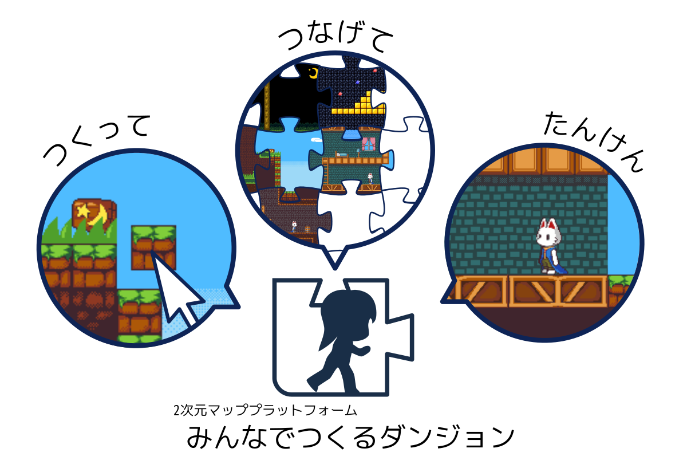
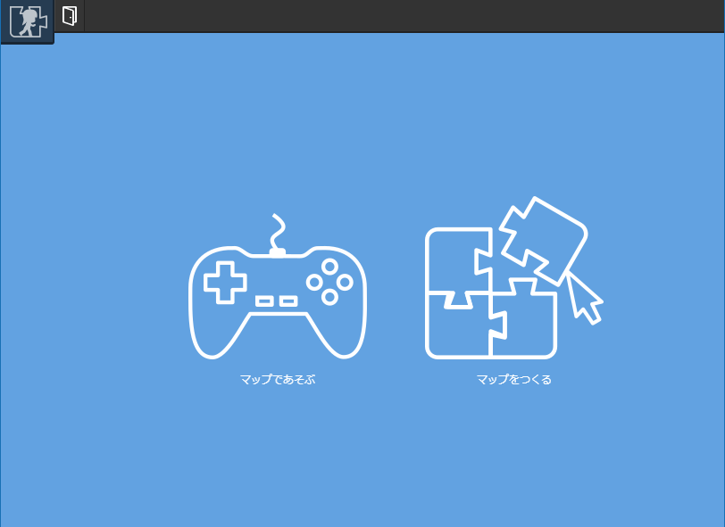

# みんなでつくるダンジョン：ヘルプ

[みんなでつくるダンジョンのトップページはこちら](https://dungeon.garakuta-toolbox.com)

## みんなでつくるダンジョンとは？
マップを作ってつなげて遊ぶことができる2次元マッププラットフォームです。
以下のことができます。

- じぶんのキャラクターをつくってマップを探検
- マップをつくって他のマップとつなげる

マップを作ってつなげて、広大なダンジョンをみんなでつくろう！というウェブサービスです。ぜひマップを作ってつなげて楽しい空間をつくってください。

:::tip チュートリアル
[チュートリアル](/guide/tutorial/)ページにて、マップをつくる一通りの工程を解説しています。ぜひみてみてください。
:::

:::tip お願い
ヘルプページはまだやや作りかけ感があるので、わからないことがあれば「ヘルプ更新して！」と作者（[Twitter](https://twitter.com/piyorinpa)）に報告してみてください！
:::

## こんなかんじにマップをつくります

<iframe width="560" height="315" src="https://www.youtube.com/embed/90dTCJ7Esfk" frameborder="0" allow="accelerometer; autoplay; encrypted-media; gyroscope; picture-in-picture" allowfullscreen></iframe>

## サポートするブラウザ
以下のブラウザの動作をサポートします（それ以外のブラウザの動作不具合については基本的にサポートしません）

- Google Chrome最新版
- Firefox最新版

## マップであそぶ
作者がつくったマップに試しにアクセスしてみましょう！

- [https://dungeon.garakuta-toolbox.com/maps/1](https://dungeon.garakuta-toolbox.com/maps/1)
- [https://dungeon.garakuta-toolbox.com/maps/14](https://dungeon.garakuta-toolbox.com/maps/14)

ログインすると、マップにつながったほかのマップへ移動することができるようになります。ぜひアカウント登録してみてください。

## アカウントを登録する
みんなでつくるダンジョンでマップを作ったり探検したりするにはアカウント登録が必要です。
[登録ページ](https://dungeon.garakuta-toolbox.com/auth/sign_up) にてアカウント登録をしてください。

## ログインしてみる

アカウントを作ったらログインしてみましょう。ログインすると「マップを作る」「マップであそぶ」のいずれかを選べます。

### マップをつくる

マップをつくるには、ログイン後に「マップをつくる」を選択します。だいたい以下のように編集していきます。

1. [画像](/guide/texture/)を登録する
1. [アニメーション](/guide/animation/)をつくる
1. [アイテム](/guide/item/)を配置して先ほどつくったアニメーションをアイテムに設定し、壁や天井を作る
1. [キャラクタ](/guide/avatar/)を登録したらお試しプレイしてみる
1. [コネクタ](/guide/connector/)を配置して他のマップとつなげる
1. [サウンド](/guide/sound/)をアップロードしてBGMを設定する
