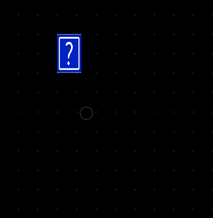
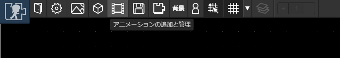
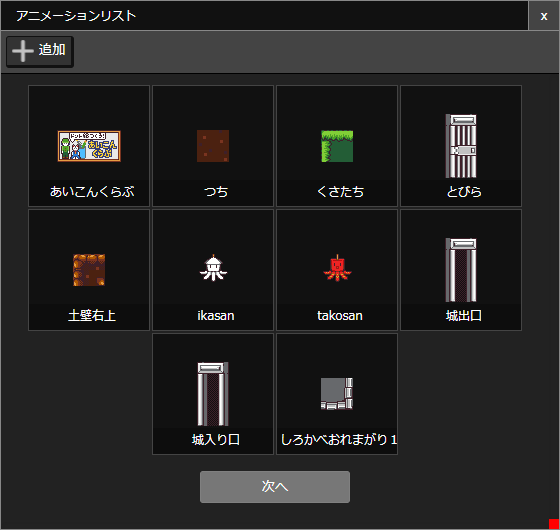
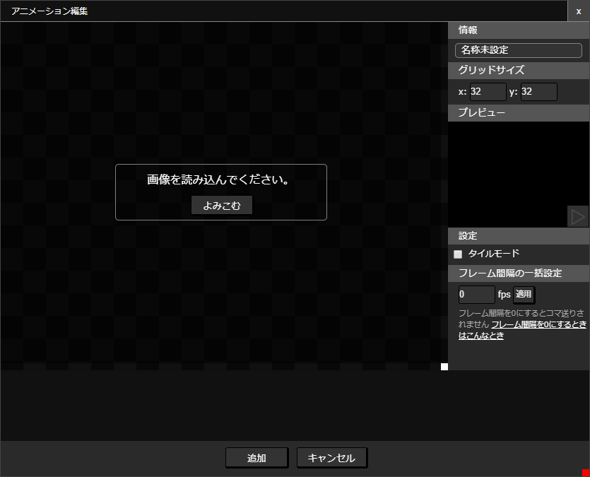
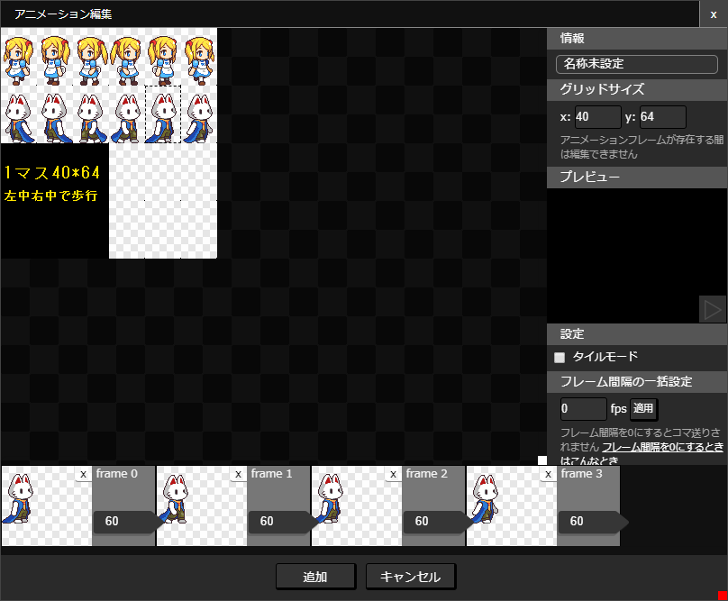
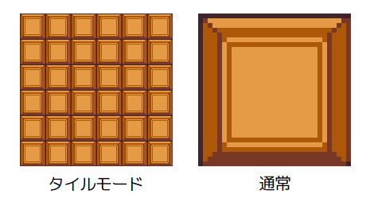
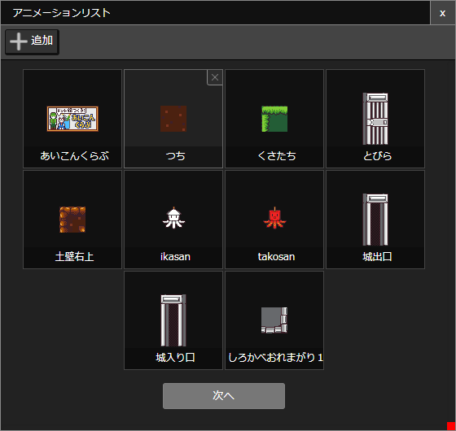
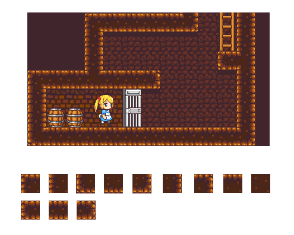
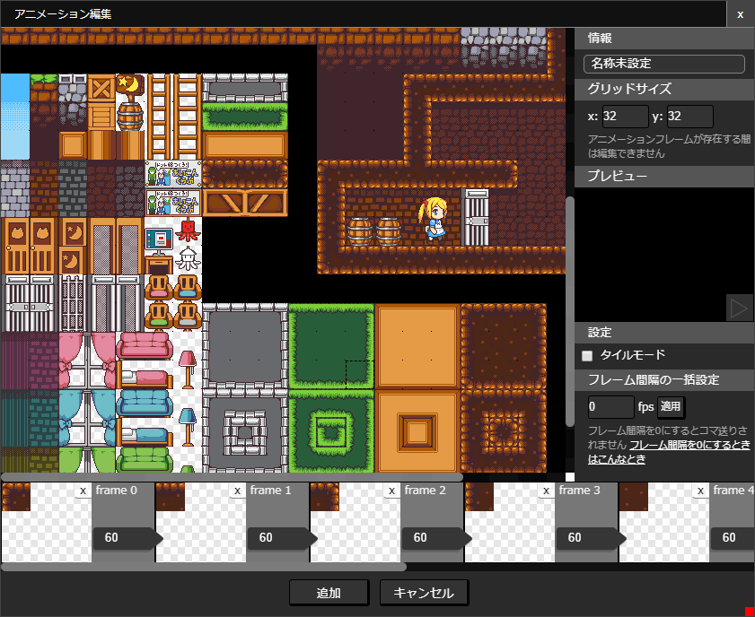
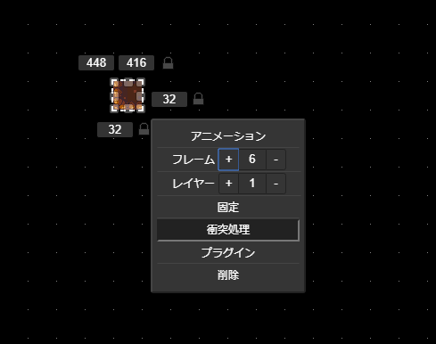

# アニメーション

アニメーションをつくると、[パーツ](/guide/item/)に動画や静止画を設定することができます。

## アニメーションの新規作成
ツールバーから「アニメーションの追加と管理」ボタンをおします。

追加ボタンを押します

表示されるウインドウの「よみこむ」ボタンを押してアニメーションにしたい画像を選びます（一枚しか選べません）

::: tip 画像の選択
予め[画像](/guide/texture/)を登録しておく必要があります。
:::

画像を選び終わると以下のような画面が表示されます

以下のように編集していきます

1. 名称を決定します。
1. グリッドサイズを設定します。アニメーション1フレームあたりの大きさを設定すると良いです。
1. はじめのフレームを選択します。画像が表示されている領域をドラッグすると矩形選択ができます。
1. フレームリストに追加したフレームが表示されます。フレームリストの数字を変更するとフレームの切替速さを調整できます。
1. つぎつぎとフレームを追加していきます。
1. タイルモード（大きさを変更したときに画像を並べて表示する機能）を有効にする場合は「[タイルモード](#タイルモード)」にチェックを入れます。
1. 編集が完了したら「追加」ボタンを押します。

## アニメーションをパーツに適用

作ったアニメーションは、主にパーツに適用することにつかいます。下図のように、パーツをクリックしてメニューから「アニメーション」を選択し、アニメーションを選ぶとパーツにアニメーションが適用されます。

## タイルモード

タイルモードにするとパーツのサイズを変えたときにアニメーションが並べて表示されます。

[アニメーション編集画面](#アニメーションの新規作成)で設定できます。

## アニメーションの削除
アニメーションを削除するには、ツールバーの「アニメーションの追加と管理」を押して表示されるウインドウから削除したい画像にカーソルを合わせ、「×」ボタンを押します。

::: warning 注意
アニメーションがパーツに適用されている状態でも削除できてしまいます。この場合、該当のパーツにはアニメーション適用前の「はてなマーク」が表示されます。
:::

## 静止画をアニメーションとして登録するコツ

たとえばかべを作るとすると、以下のようなマップチップが必要になりそうですが、1チップにつき1つのアニメーションを作ると、アニメーションの数が膨大になってしまいます。そこで、以下のように作ることをおすすめします。

このように、マップチップを1フレームずつ登録します。すべてのフレームを選択し終えたら「フレーム間隔の一括設定」を0fpsにして「適用」し、すべてのフレーム切替速さを0fpsにします。

パーツにアニメーションを適用するときは、フレーム番号を設定することで表示するフレームを選択することができます。

::: tip フレーム間隔が0fpsのとき
フレーム間隔が0fpsのときはフレームの切替が行われなくなります（選択したフレームを静止画として表示します）
:::
