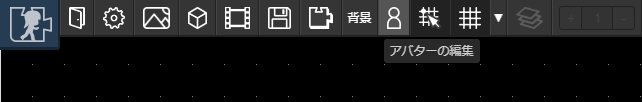

# キャラクタ
「キャラクタ」を作成することでマップ上を自由に移動することができるようになります。

## 作成できるキャラクタの制限

キャラクタの作成には以下の制限があります。

|項目|値|
| --- | --- |
|最小サイズ（幅・高さ）|32px|
|最大サイズ（幅・高さ）|128px|

## キャラクタの登録
「マップをつくる」モードで登録・編集できます。ツールバーから「キャラクタの編集」をクリックします。

キャラクタの大きさを調整します。サイズ変更はカーソルをドラッグするか、大きさを数値で入力します。

キャラクタ編集画面が表示されたら、[アニメーション](/guide/animation/)を適用していきます。

::: tip 
キャラクタに適用するアニメーションは[予め登録](/guide/animation/#アニメーションの新規作成)しておきましょう
:::

|アニメーション名|役割|
| --- | --- |
|左移動アニメーション|左向きに移動しているときのアニメーションを設定します|
|左静止アニメーション|左向きに静止しているときのアニメーションを設定します|
|右移動アニメーション|右向きに移動しているときのアニメーションを設定します|
|右静止アニメーション|右向きに静止しているときのアニメーションを設定します|

設定が終わったら「OK」ボタンを押して完了です。
