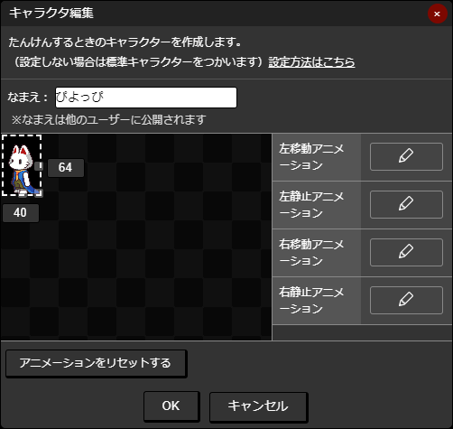

# キャラクタ
「キャラクタ」を作成することでマップ上を自由に移動することができるようになります。

## 作成できるキャラクタの制限

キャラクタの作成には以下の制限があります。

|項目|値|
| --- | --- |
|最小サイズ（幅・高さ）|32px|
|最大サイズ（幅・高さ）|128px|

## キャラクタの登録
「マップをつくる」モードで登録・編集できます。ツールバーから「キャラクタの編集」をクリックします。

以下の画面が表示されます。

### なまえの設定
[マップ](/guide/map/)や[画像](/guide/texture/)の作者情報として表示される「なまえ」を設定します。

::: warning
ここで設定したなまえは公開されます
:::

### 見た目の変更
キャラクタの大きさやアニメーションを調整します。

[アニメーション](/guide/animation/)を適用すると、マップ内で表示される自キャラの画像を変更できます。

::: tip 
キャラクタに適用するアニメーションは[予め登録](/guide/animation/#アニメーションの新規作成)しておきましょう
:::

|アニメーション名|役割|
| --- | --- |
|左移動アニメーション|左向きに移動しているときのアニメーションを設定します|
|左静止アニメーション|左向きに静止しているときのアニメーションを設定します|
|右移動アニメーション|右向きに移動しているときのアニメーションを設定します|
|右静止アニメーション|右向きに静止しているときのアニメーションを設定します|

設定が終わったら「OK」ボタンを押して完了です。
