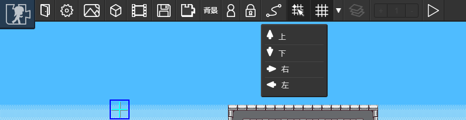
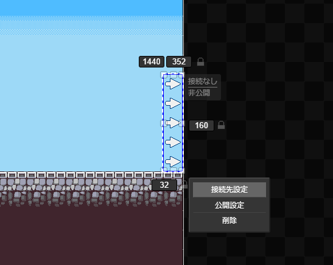
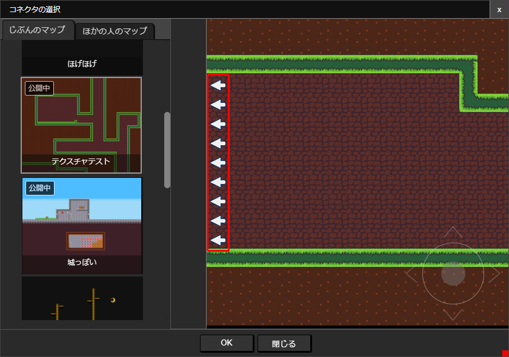
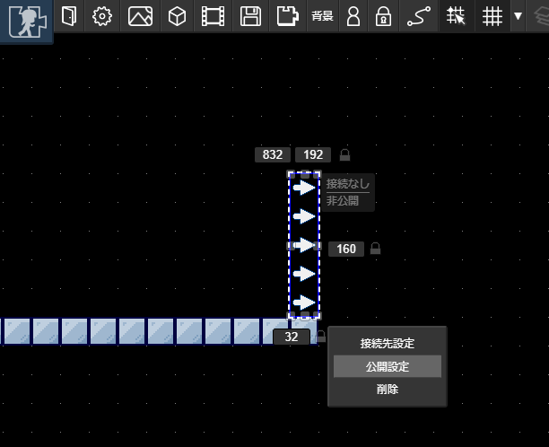

# コネクタ

マップ同士は「コネクタ」でつなぎます

## コネクタの配置
コネクタはキャラクタがどの向きから接触するかによって、４つの種類（↑、↓、→、←）を使い分けて配置します。

## コネクタの接続可能条件
コネクタの接続には、以下の条件を満たしている必要があります。

- 接続元、接続先のマップのいずれにも「エントリポイント」が存在すること
- 接続元・接続先のコネクタの向きの対応関係が正しいこと

対応関係は以下の通りです。

|接続元のコネクタの向き|接続先のコネクタの向き|
|:--:|:--:|
|→|←|
|↑|↓|
|←|→|
|↓|↑|

## じぶんのマップ同士の接続
じぶんのマップとの接続は、コネクタやマップの公開状態によらずに接続できます。

まずは接続したいコネクタを選択して「接続先設定」を押します。

::: warning 注意
マップが保存されていない場合は「保存してください」と警告が表示される場合があります。マップを保存してもう一度お試しください。
:::

表示される画面からまずはマップを選択したあと、マップ上のコネクタを選択します。コネクタをクリックすると赤枠が表示されるので、この状態で「OK」ボタンを押します。

## ほかのひとのマップと接続
ほかのひとのマップと接続するには、コネクタを「公開」状態にする必要があります。
くわしくは、[公開設定](#公開設定) を参照してください。

公開設定がおわったら、[じぶんのマップ同士の接続](#じぶんのマップ同士の接続)と同じ要領で接続することができます。

## 公開設定

コネクタの公開設定をすると、ほかのひとのマップとつなげることができるようになります。
コネクタの公開状態と接続できるマップの公開状態には以下のような関係があります。

||コネクタが公開|コネクタが非公開|
|:--:|:--:|:--:|
|マップが公開|●|△|
|マップが非公開|●|△|

●：どのマップとも接続できる △：じぶんのマップのみと接続できる

::: tip ほかの人のマップのコネクタが接続後に非公開になったとき
接続状態は維持されますが、キャラクタが接続先のマップに移動できなくなります。
:::

コネクタの公開設定をするには、設定したいコネクタをクリックし、「公開設定」を選択します。表示されたウインドウから公開設定をすることができます。
