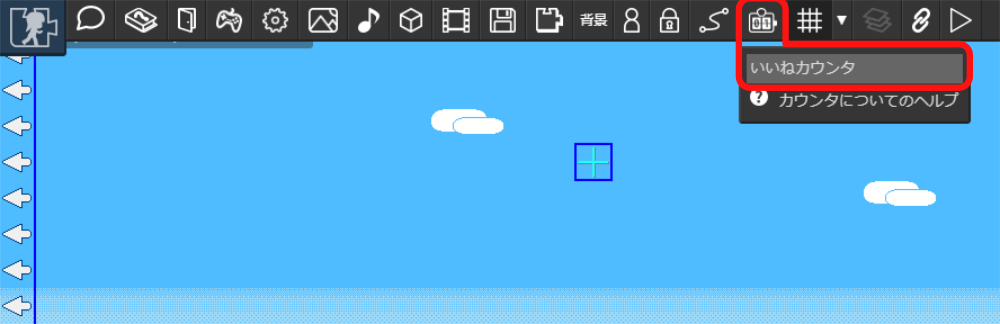
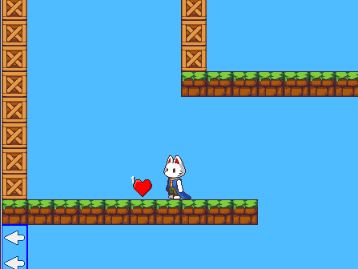

# カウンタ
  
マップを訪れたユーザーに「いいね」の投票をしてもらえる「カウンタ」を設置できます。

## 設置
保存済みマップに設置できます。保存されているマップの場合はツールバーにカウンタ設置メニューが表示されるので、「いいねカウンタ」を選択してマップ上に設置します。

## カウント値の確認
設置したカウンタのあるマップをたんけんすると、ハートマークのいいねカウンタの左上にカウント数が表示されます。

::: tip カウンタを消したとき
カウンタを消してもカウント値は失われません。再設置すると保持されたカウント値が反映されます。
:::
