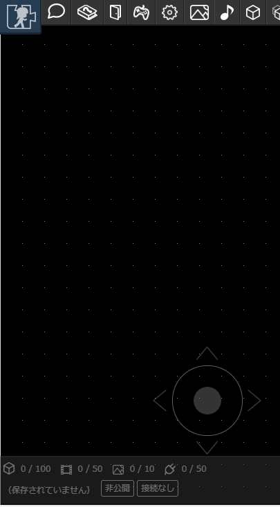
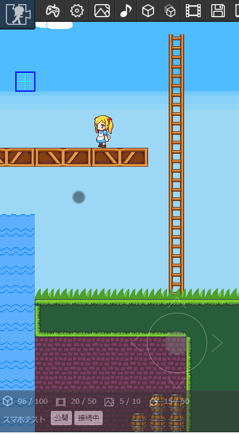
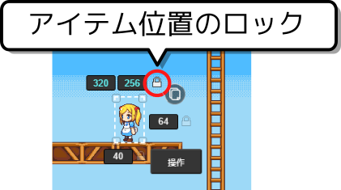
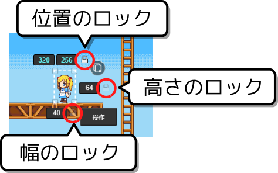

# スマートフォンでの編集
スマートフォンでもマップの編集を行えるようになりました。

## 上部メニュー
上部メニューはスクロールできます。画面に隠れているボタンはスクロールで探してみてください。

## マップのスクロール
ゆび1本でマップをスクロールできます。また、画面右下のスティックを使うこともできます。

アイテムの位置がロックされている場合は、アイテムに指が触れてもスクロールできます。

アイテムの位置がロックされていない場合は、アイテムに触れるとアイテムの位置を移動できます。

:::tip ポイント
アイテムの位置をこまめにロックしておくとスクロールしやすくなります
:::

## アイテムの位置・大きさのロック
アイテムの位置や大きさをロックしておくと、不意に指が触れるなどした意図せぬ変更を防ぐことができます。
スマートフォンなどの画面が小さなデバイスには有用ですので、活用してみてください。

## ピンチイン・ピンチアウトによる拡大縮小
現在は対応していません。（対応を予定しています）

## 不具合があったとき
スマートフォン対応はできたてほやほやなので、もし不具合がある場合は作者（[Twitter](https://twitter.com/piyorinpa)）に言ってみてください。

