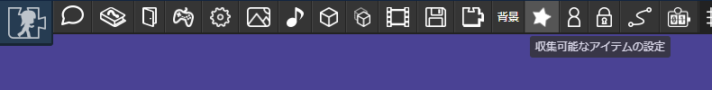
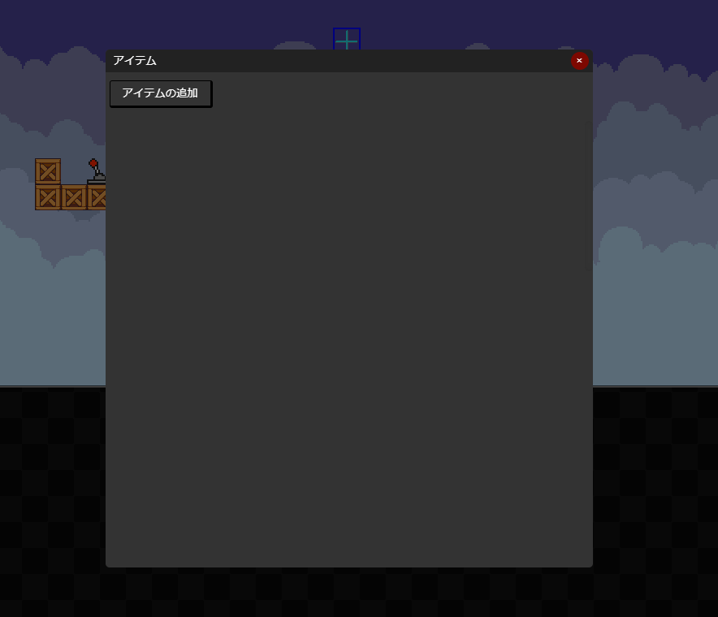
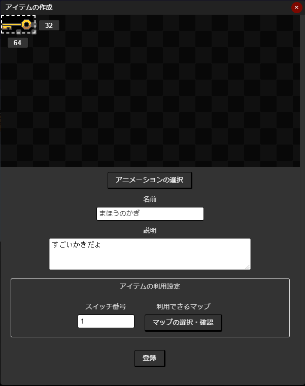
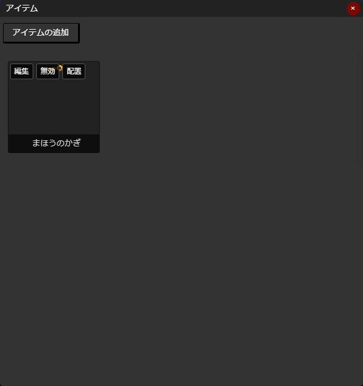
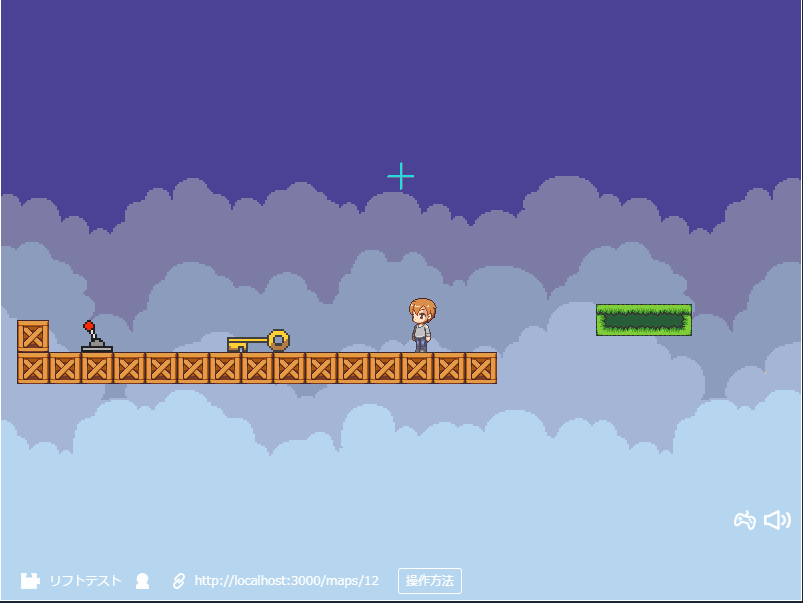

# アイテムの収集

収集可能なアイテムをつくることで、マップに置かれたアイテムをあつめたり、アイテムを使ったりできます。

## 収集可能なアイテムの作成

ツールバーにある  をクリックします。

上図のような画面が表示されるので、「アイテムの追加」を押して、登録画面を表示します。

1. アニメーションを選択します
1. 名前をつけます
1. アイテムの説明を書きます。アイテム一覧に表示されます。
1. アイテムの利用設定をします（詳細は後述します）

アイテムの利用設定をすると、指定したマップでアイテムを「つかう」ことができます。
アイテムをつかうと、指定したスイッチ番号のスイッチがONになります。

## アイテムの削除・編集・配置

### 削除
削除したいアイテムにカーソルを合わせ、表示される「削除」ボタンを押します。
（スマートフォンの場合は削除したいアイテムをタップし、表示される「削除」ボタンを押します。）

:::warning 注意
アイテムを削除しても、ほかのユーザーがアイテムを持っている場合は情報は削除されません。
退会後もアニメーション以外の情報（名前、説明など）は残り続けるのでご注意ください。
:::

### 編集
内容を変更したいアイテムにカーソルを合わせ、表示される「編集」ボタンを押します。
（スマートフォンの場合は削除したいアイテムをタップし、表示される「編集」ボタンを押します。）

### 配置
配置したいアイテムにカーソルを合わせ、表示される「配置」ボタンを押します。
（スマートフォンの場合は削除したいアイテムをタップし、表示される「配置」ボタンを押します。）

マップ上に配置されるので、位置やレイヤーを変更して配置します。

## アイテムの収集

アイテムを収集するには、アイテムの上で「X」キーを押します。

## アイテム一覧
アイテム一覧を表示するには、「Q」キーを押すか、画面内の「アイテム」ボタンを押します。

アイテムをクリック・タップしたり、十字キーで選択すると、アイテムを捨てたり使ったりすることができます。
