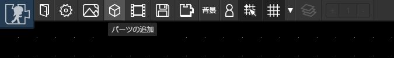

# アイテム

マップ上に「アイテム」を配置して、壁や天井をつくったり、マップチップや画像を配置することができます。

## アイテムの配置
アイテムを配置するには、ツールバーの「アイテムの追加」ボタンを押します。

するとマップにはてなマークがついた物体が登場します。これが「アイテム」です。アイテムをクリックすると、マップの大きさを変更したり、アイテムにいろいろな設定をすることができます。

各設定は以下の通りです。

|機能名|内容|
| --- | --- |
|アニメーション|アイテムに静止画やアニメーションを設定できます|
|フレーム|アニメーションのどのフレームを表示するか設定できます|
|レイヤー|どのレイヤーに属するかを設定できます|
|固定|重力の影響の有無を設定できます|
|衝突処理|他アイテムやキャラクタがぶつかったときに跳ね返るかどうかを設定できます|
|プラグイン|プラグインを設定できます [くわしくはこちら](/guide/plugin/)|
|削除|アイテムを削除します|

## レイヤーの変更
レイヤーを設定するとアイテムの表示の前後関係を調整できます。レイヤーはレイヤー番号0～4までの5つあり、数字が大きいほど手前（重なった時に前側に）に表示されます。

アイテムのレイヤーを変更するには、アイテムをクリックして表示される「レイヤー」の数字を設定します。

## 大きさの変更

大きさを変更するには、アイテムを選択すると表示される小さい四角のいずれかをドラッグアンドドロップします。選択すると表示されるテキストボックスを用いて、サイズを直接数字で入力することもできます。

## 大きさ・位置の固定

大きさや位置を固定すると、誤った編集を防ぐことができます。アイテムを選択したら、をクリックします。

## プラグイン

プラグインをつかうとアイテムを動かしたり、付加機能をつけることができます。詳しくは[プラグイン](/guide/plugin/) をご覧ください。
