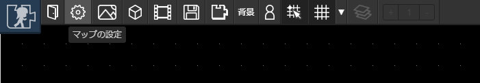
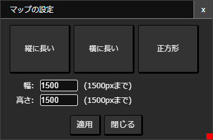

# マップ

アバターはマップのなかを探検したり、他のマップに移動することができます。また、じぶんでマップを作って他のマップとつなげることもできます。

## マップを構成するもの

### [アイテム](/guide/item/)
壁や床・看板などなど、マップは「[アイテム](/guide/item/)」によって構成されます。

### レイヤー
アイテムは「レイヤー」とよばれる層状の領域で管理されています。レイヤーの番号が小さいほど奥に、大きいほど手前に表示されます。

### 背景
背景はほかのアイテムと違い、キャラクター移動時のスクロール具合を調整できるので、かんたんに遠景を表現できます。背景はレイヤー0に配置されます。

### [アバター](/guide/avatar/)
マップを移動できるキャラクターです。アバターはレイヤー2に配置されます。

## マップの編集

### マップサイズの変更
ツールバーの「マップの設定」をクリックします。

表示された画面でマップサイズを変更できます。

- マップサイズは面積が1500x1500pxが最大値です。たとえば幅を小さくするとその分高さを大きく取ることができます。
- 「横に長い」「縦に長い」「正方形」ボタンは、それぞれマップサイズを適当に調整します。
- 適用ボタンをクリックすると適用されます。

### 背景の設定
