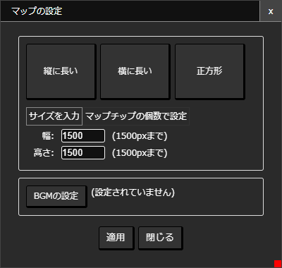

# マップ

アバターはマップのなかを探検したり、他のマップに移動することができます。また、じぶんでマップを作って他のマップとつなげることもできます。

## マップを構成するもの

### [アイテム](/guide/item/)
壁や床・看板などなど、マップは「[アイテム](/guide/item/)」によって構成されます。

### レイヤー
アイテムは「レイヤー」とよばれる層状の領域で管理されています。レイヤーの番号が小さいほど奥に、大きいほど手前に表示されます。

### 背景
背景はほかのアイテムと違い、キャラクター移動時のスクロール具合を調整できるので、かんたんに遠景を表現できます。背景はレイヤー0に配置されます。

### [アバター](/guide/avatar/)
マップを移動できるキャラクターです。アバターはレイヤー2に配置されます。

### エントリポイント
[コネクタ](/guide/connector/)経由以外からマップを訪れたときにアバターをどの位置に配置するかを設定します。（エントリポイントがないマップは他のマップと接続できません）

エントリポイントを配置するにはツールバーから「エントリポイントの追加」を選択します。

::: warning 注意
- マップが保存されていない場合はエントリポイントの追加ボタンが表示されません
- エントリポイントはマップにひとつしか配置できません（配置されているときは「エントリポイントの追加」ボタンは表示されません
- マップがほかのコネクタと接続されているときはエントリポイントの削除ができません。
:::

## マップをひらく

マップをひらくにはツールバーの「マップをひらく」ボタンを押します。

表示されるマップ一覧から読み込みたいマップを選択してください。

## マップサイズの変更
ツールバーの「マップの設定」をクリックします。

表示された画面でマップサイズを変更できます。

- マップサイズは面積が1500x1500pxが最大値です。たとえば幅を小さくするとその分高さを大きく取ることができます。
- 「横に長い」「縦に長い」「正方形」ボタンは、それぞれマップサイズを適当に調整します。
- 適用ボタンをクリックすると適用されます。

## 背景の設定

::: tip おしらせ
背景としてつかいたいアニメーションを予め登録しておく必要があります。
:::

キャラクター移動時のスクロール具合を調整できるので、かんたんに遠景を表現できます。背景はレイヤー0に配置されます。

設定したいアニメーションを選択します。「スクロール量」を1より小さくすると、背景のスクロールがキャラクター移動によるスクロールに対して遅くなるので、遠景を表現することができます。

## つくったマップであそんでみる

作ったマップをアバターで探検するには、ツールバーから「このマップを探検する」をクリックします。

::: warning 注意
- [アバターが設定](/guide/avatar/)されていないときはマップを探検することができません。
- マップが保存されていない場合は「このマップを探検する」ボタンが表示されません。
:::

## 公開設定
ほかのひとに自分のマップをつなげてもらうには、「公開設定」をする必要があります。

ツールバーの「」をクリックします
