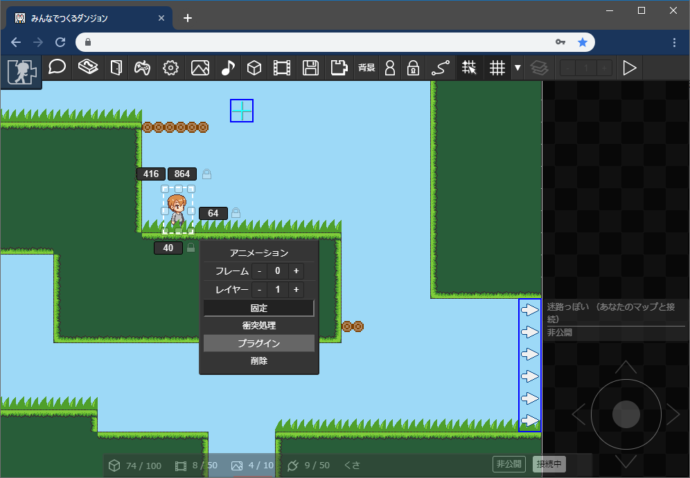
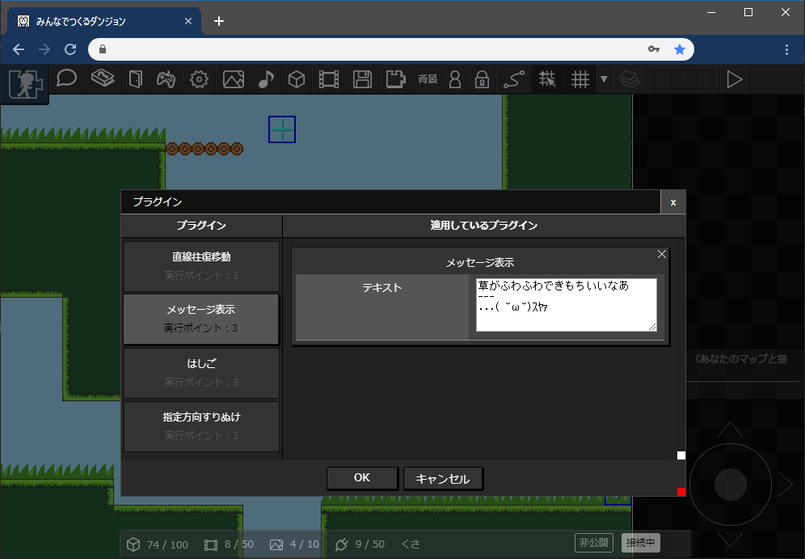
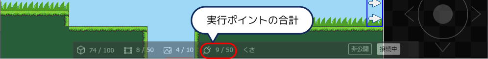

# プラグイン

プラグインをつかうと、パーツに付加機能をつけることができます。現在、以下のプラグインを利用することができます。

- [メッセージ表示](message)
- [直線往復移動](linear_move)
- [はしご](ladder)
- [重力制御](gravity)
- 指定方向すりぬけ
- [スイッチ](switch)
- [スイッチで衝突判定切替](colision_switch)
- [ラベル](label)
- [パーツが触れたら押されるスイッチ](touch-switch)

## プラグインの追加

プラグインを設定したいパーツを選択し、メニューから「プラグイン」を選択します。

利用したいプラグインを「プラグイン」から選択すると、「適用しているプラグイン」リストにパーツが追加されます。
利用するプラグインに応じて各項目を設定します。

## 追加できるプラグイン数の上限

プラグインには「実行ポイント」が存在します。マップ内のすべてのパーツのプラグインの実行ポイントが50ポイントを超えると保存できません。

現在のポイント数はマップ編集画面の下部で確認することができます。
