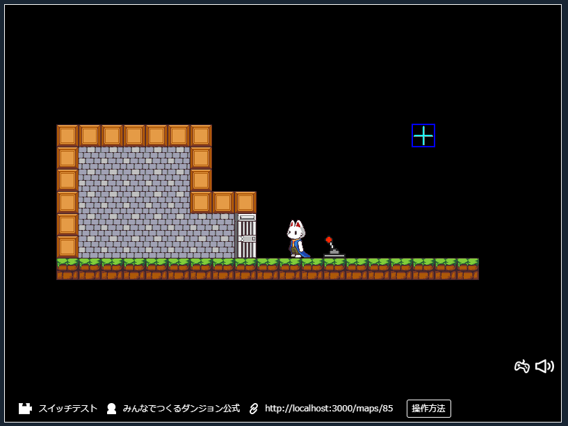
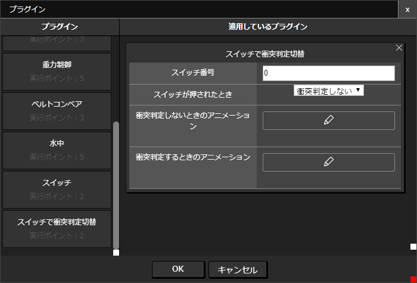

# スイッチで衝突判定切替プラグイン

スイッチのON・OFFの状態でアイテムの衝突判定を切り替えます。

（スイッチには[スイッチ](./switch)プラグインをつかっています）

## つかいかた

「スイッチで衝突判定切替」プラグインを選択し、項目を設定します。

|項目|内容|
| --- | --- |
| スイッチ番号 | スイッチの識別番号です。衝突判定切替のためのスイッチをスイッチ番号で設定します。 |
| スイッチが押されたとき | スイッチが押されたときの状態を設定します。 |
| 衝突判定しないときのアニメーション | 衝突判定をしないときに表示するアニメーションを設定します。設定しない場合は何も表示されなくなります。 |
| 衝突判定するときのアニメーション | 衝突判定をするときのアニメーションを設定します。設定しない場合は初期設定アニメーションが表示されます。 |
