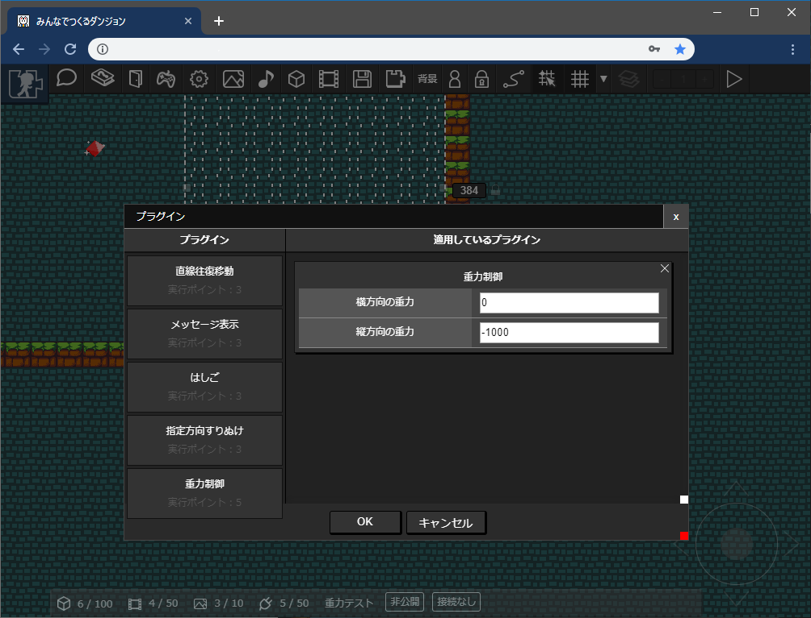

# 重力制御プラグイン

「プラグインを適用したパーツ」に触れたパーツの重力の向きがかわります。

たとえば動画中の白い流れのぶぶんのパーツに重力制御プラグインを導入します。キャラクターやパーツが白い流れに触れると重力の向きが上向きになっています。

## プラグインの場所

「移動 / 移動処理」 -> 「重力制御」

## つかいかた

「重力制御」プラグインを選択し、項目を設定します。

|項目|内容|
| --- | --- |
| 横方向の重力 | 横方向の重力を設定します。正の値で右向きに、負の値で左向きに重力が発生します。 |
| 縦方向の速度 | 縦方向の重力を設定します。正の値で下向きに、負の値で上向きに重力が発生します。 |

:::tip ふだんの重力
このプラグインをつかわないとき、各パーツやキャラクタには下向きに1000の重力が加わっています。値の設定の参考にしてください。
:::
