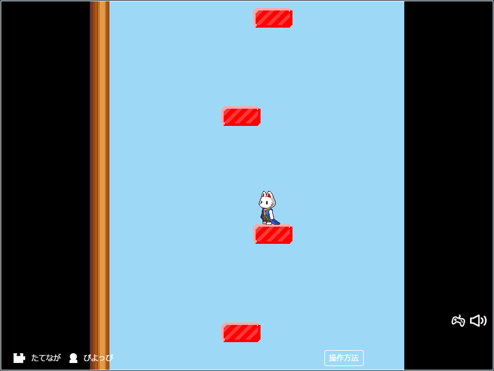
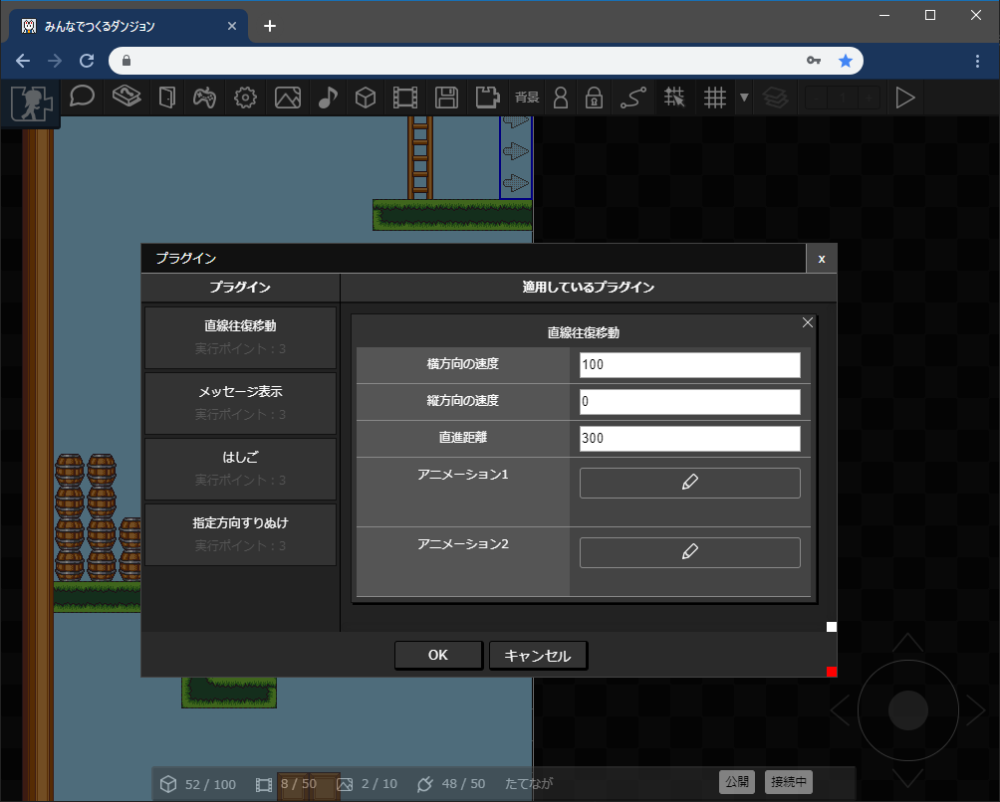

# 直線往復移動プラグイン

設定したアイテムを直線往復移動させることができます。右往左往するキャラクターや、うごくリフトを作ることができます。

## つかいかた

「直線往復移動」プラグインを選択し、項目を設定します。

|項目|内容|
| --- | --- |
| 横方向の速度 | 1秒あたりに移動する距離（ピクセル数）を設定します。負号をとると左側、0より大きい値で右側に移動します |
| 縦方向の速度 | 1秒あたりに移動する距離（ピクセル数）を設定します。負号をとると上側、0より大きい値で下側に移動します |
| 直進距離 | 折り返すまでに進む距離（ピクセル数）を設定します。 |
| アニメーション1 | 往路のときに表示するアニメーションを設定できます（設定しないとアイテムのアニメーションがそのまま使われます） |
| アニメーション2 | 復路のときに表示するアニメーションを設定できます（設定しないとアイテムのアニメーションがそのまま使われます） |
