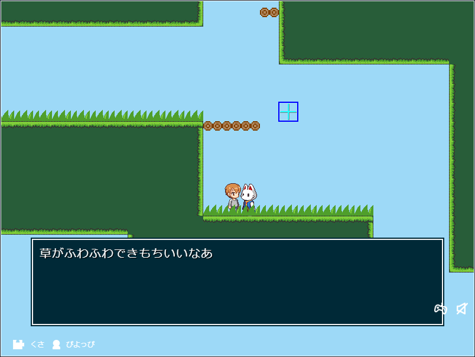
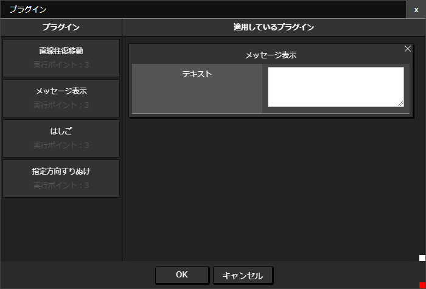
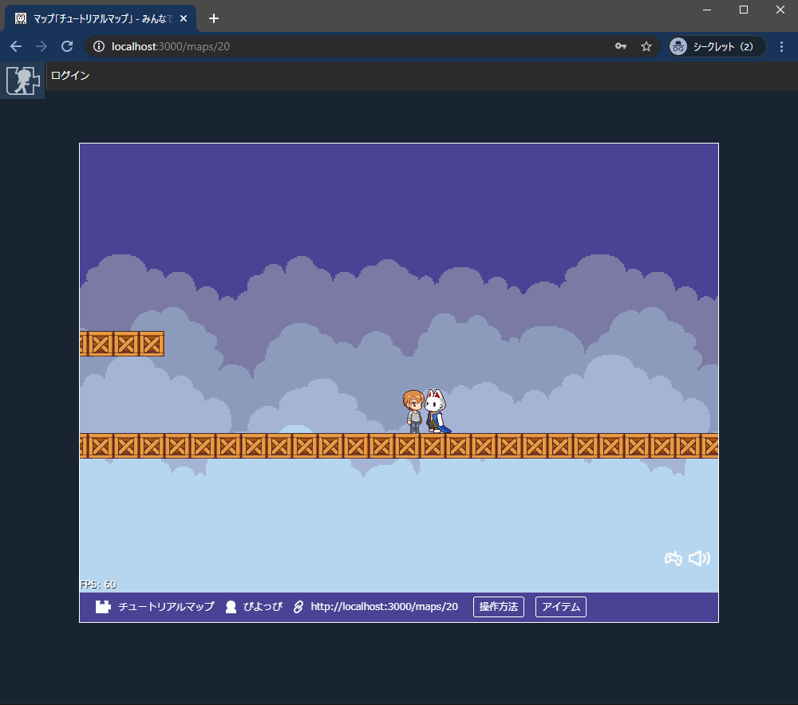

# メッセージ表示プラグイン

設定したパーツに触れた状態で「x」キーを押すことで、メッセージを表示させることができます



[サンプルマップはこちら](https://dungeon.garakuta-toolbox.com/maps/268)

## プラグインの場所

「メッセージ表示」 -> 「メッセージ表示」

## つかいかた

### メッセージを設定する


「メッセージ表示」プラグインを選択し、「テキスト」を設定します。

::: tip メッセージをいくつも出したいとき
たとえば以下のように「---」 で区切るとメッセージを分割して表示することができます。

```
こんにちは
---
ようこそ
```
:::

### 他のページへのリンクを挿入する
指定の書式でURLを載せると、リンク先に遷移させることができます。

たとえば、以下のように「メッセージ表示」プラグインの「テキスト」を設定します。（最後の行は改行しないでください）


```
こんにちは！わたしのウェブサイトにもきてみてね！
---
https://garakuta-toolbox.com
```

結果がこちら。



::: warning 注意

以下のようには書けません（リンクの挿入が行われません）。

- URLだけ書いてある

```
https://garakuta-toolbox.com
```

- URLの行に改行がある

```
こんにちは！
---
https://garakuta-toolbox.com

```

- URLの行がメッセージの末尾でない

```
こんにちは！
---
https://garakuta-toolbox.com
---
よろしくね！
```

- URL以降に余計なメッセージが含まれている

```
こんにちは！
---
https://garakuta-toolbox.com
よろしくね！
```

- URLが不正

```
こんにちは！
---
ttps://garakuta-toolbox.com
```
:::
