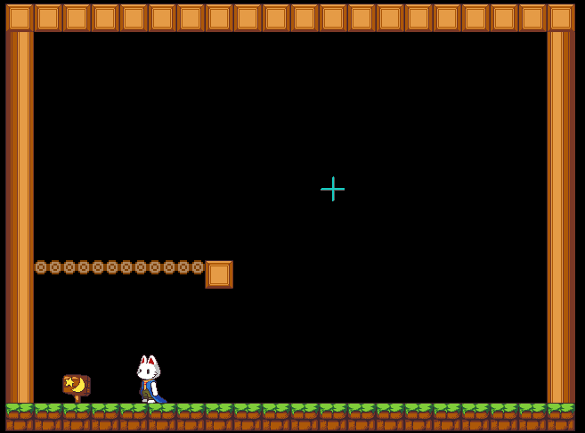

# 指定方向すり抜け

指定方向にだけ通過できるようにします。

[サンプルマップはこちら](https://dungeon.garakuta-toolbox.com/maps/267)

## プラグインの場所

「移動 / 移動処理」 -> 「指定方向すり抜け」

## つかいかた

「指定方向すり抜け」プラグインを選択し、項目を設定します。

|項目|内容|
| --- | --- |
| 方向 | 上：下から上へのすり抜け, 下：上から下へのすり抜け, 右：左から右へのすり抜け, 左：右から左へのすり抜け |
