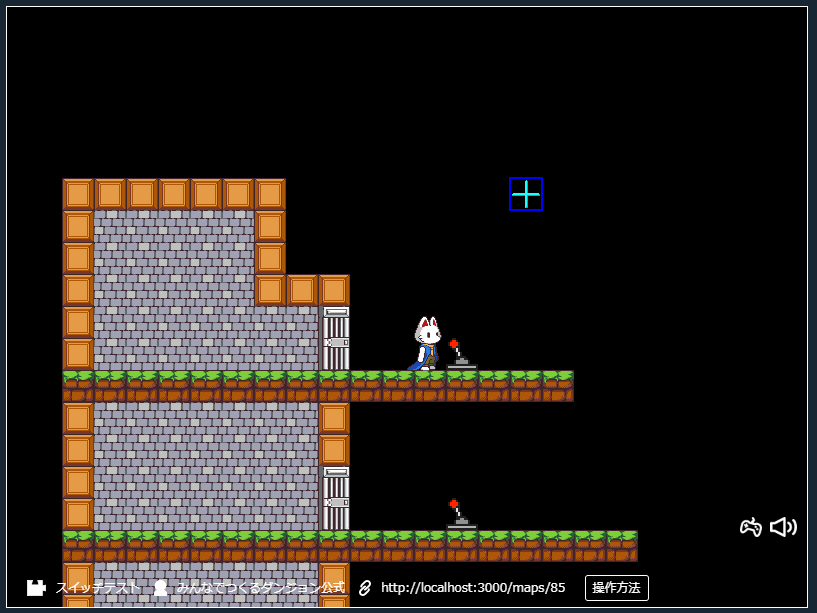
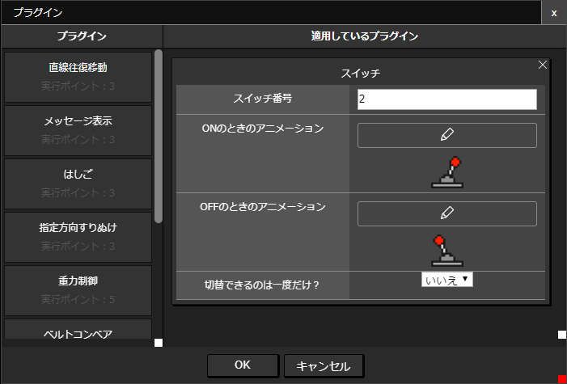

# スイッチプラグイン

設定したパーツに触れた状態で「x」キーを押すことで、スイッチのON・OFFを切り替えることができます

（ドアの開閉には[スイッチで衝突判定切替](./colision_switch)プラグインをつかっています）

## プラグインの場所

「スイッチ制御」 -> 「スイッチ」

## つかいかた

「スイッチ」プラグインを選択し、項目を設定します。

|項目|内容|
| --- | --- |
| スイッチ番号 | スイッチの識別番号です。0～99までの整数値を設定します。 |
| ONのときのアニメーション | ONのときに表示するアニメーションを設定します |
| OFFのときのアニメーション | OFFのときに表示するアニメーションを設定します |
| 切替できるのは一度だけ？ | 一度切り替えたら操作できないようにするかどうか設定します |
