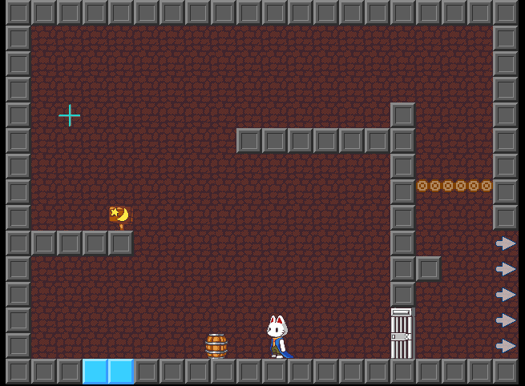
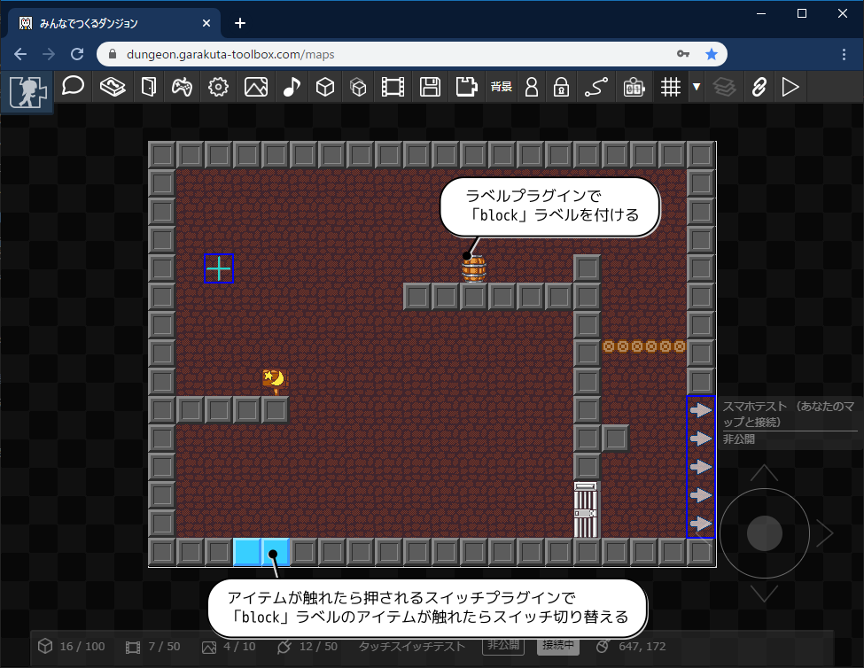
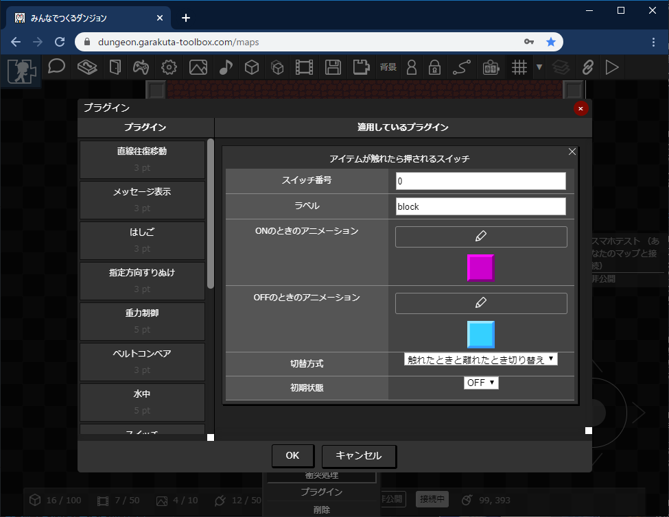

# アイテムが触れたら押されるスイッチプラグイン

このプラグインを設定したアイテムが、指定したラベルを持つアイテムと触れたときにスイッチのON・OFFを切り替えることができます。

（[ラベルプラグイン](./label)と組み合わせて使います）
（ドアの開閉には[スイッチで衝突判定切替](./colision_switch)プラグインをつかっています）

このようにプラグインが設定されています。

## つかいかた

「アイテムが触れたら押されるスイッチ」プラグインを選択し、項目を設定します。

|項目|内容|
| --- | --- |
| スイッチ番号 | スイッチの識別番号です。0～99までの整数値を設定します。 |
| ラベル | ラベル（文字列）を設定します。触れる対象のアイテムには[ラベルプラグイン](./label)でラベルを設定しておきます。 |
| ONのときのアニメーション | ONのときに表示するアニメーションを設定します |
| OFFのときのアニメーション | OFFのときに表示するアニメーションを設定します |
| 切替方式 | アイテムが触れたり離れたりしたときのスイッチの挙動を設定します |
| 初期状態 | スイッチの初期状態を設定します |

