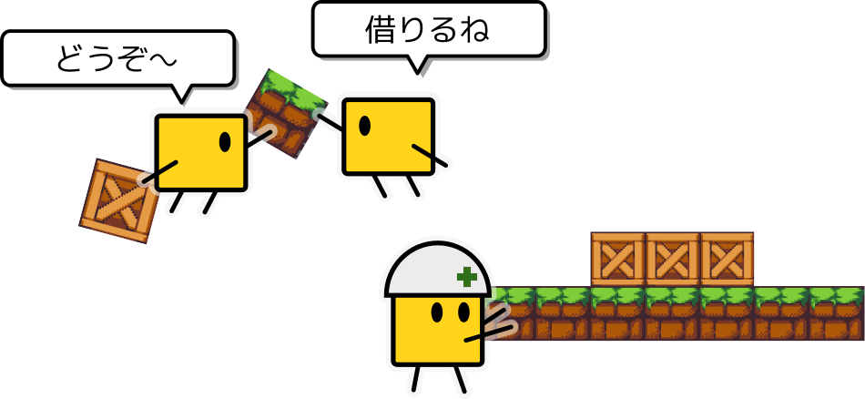
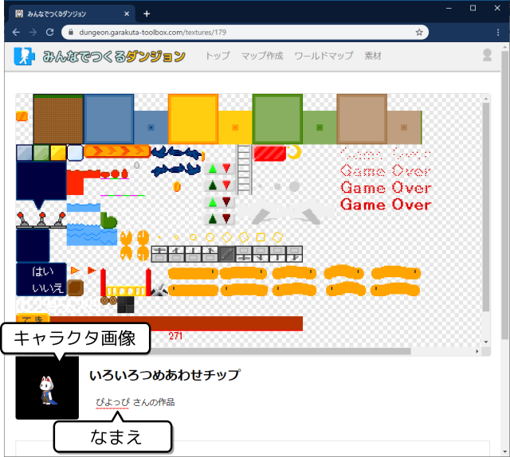
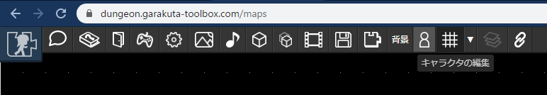
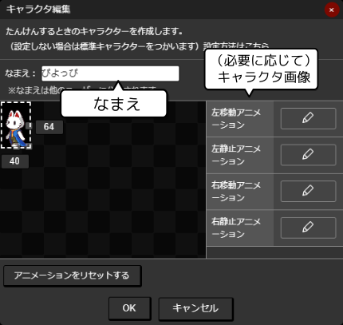
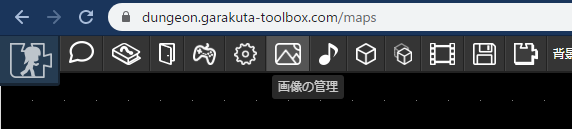
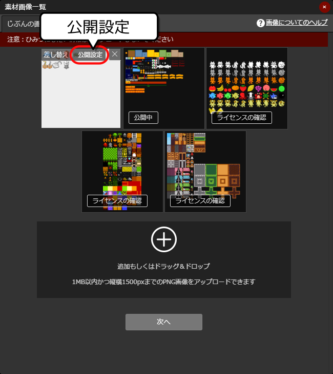
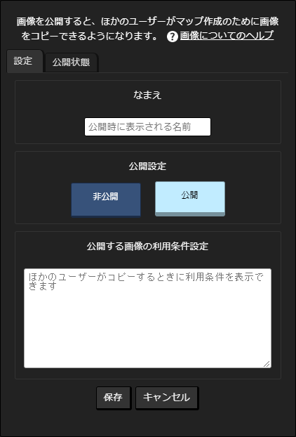
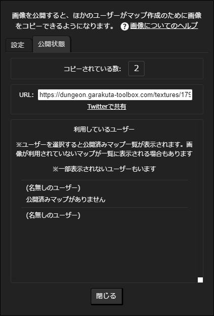
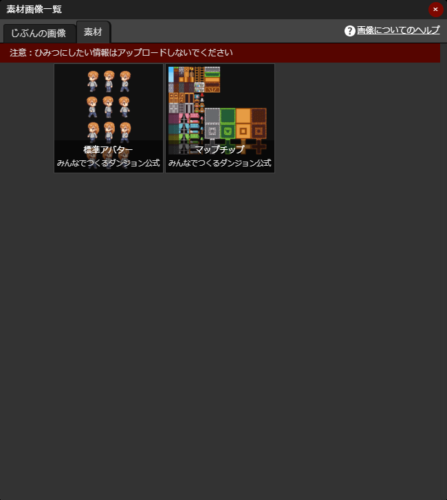

# 画像素材の公開

みんなでつくるダンジョンのマップ作成につかえる画像を登録して公開できます。

- 公開するとほかのひとが画像をコピーして使えるようになります
- 公開ページに表示する「利用条件」を設定できます
- 公開後は以下の情報を確認できます
  - コピーされた数
  - 利用されているマップ（素材が利用されているマップが公開されている場合）

:::warning 注意
- 一度画像を公開すると、公開を取りやめた際もそれまでにコピーされた画像は利用され続けます
- 公開後に画像の[更新](/guide/texture/#更新方法)を行った場合、それまでにコピーされた画像は差し替えられません
- 退会後もコピーされた画像は利用され続けます
:::

たとえばこんな使い方ができます。ぜひぜひ登録してみてください。

- ゲーム素材のお試し素材を登録してつかってもらう
- 製作途中のゲーム用の素材をちょっとだけ公開してつかってもらう

:::tip
公開機能はまだ不十分かもしれません。要望があれば [@piyorinpa (twitter)](https://twitter.com/piyorinpa) までお気軽にご連絡ください。
:::

## 登録できる画像の規格

- ファイルサイズ1MB以内
- 画像フォーマットはPNGのみ（透過PNGをサポートしています）
- 縦、横ともに1500px以内

マップチップ素材については、1チップの幅や高さに制限はありません。1枚の画像に複数の大きさのマップチップがあっても大丈夫です。
また、マップチップのほか、背景素材などなども登録できます。

アニメーションを想定した画像は、上記のようにコマすべてが1枚の画像に収まるようにしてください。

## 画像の登録の前に

画像の登録の前に、自身の「キャラクタ」を設定しておくと、画像詳細画面で名前やキャラクタアニメーションが表示されます。

:::warning 注意
- キャラクタにアニメーションを設定しない場合、デフォルトのキャラクタが表示されます
- キャラクタに名前を設定していない場合、「（名前がありません）」と表示されます
:::

---

キャラクタ情報の登録は、[マップ作成ページ](https://dungeon.garakuta-toolbox.com/maps)でログインして、「キャラクタの編集」を押します。

---

表示されたウインドウで「なまえ」を設定します。
アニメーションは必要に応じて設定します。くわしくは[#キャラクタの登録](/guide/avatar/#キャラクタの登録)をご覧ください。

:::tip
- 「なまえ」の登録は強くおすすめします
  - 登録しないと画像ページなどで「名前がありません」と表示されてしまいます
- キャラクタのアニメーションは必要に応じて登録します
  - 登録しない場合はデフォルトキャラクタ画像が表示されます
:::

## 画像の登録

[マップ作成ページ](https://dungeon.garakuta-toolbox.com/maps)でログインして、「画像の管理」を押します。

---

画像をドラッグアンドドロップで追加できます。もしくは、「追加」ボタン（上図の + ボタン）でも追加できます。

公開中の素材の場合は「公開中」と表示されます。公開したい画像を選んで「公開設定」を選択します。

---

なまえと利用条件を設定し、公開設定から「公開」を選択して「保存」ボタンを押すと完了します。

:::warning 公開の前に今一度ご確認ください！
- 公開する画像に権利侵害がないかどうかをご確認ください
- 一度画像を公開すると、公開を取りやめた際もそれまでにコピーされた画像は利用され続けます
- 公開後に画像の[更新](/guide/texture/#更新方法)を行った場合、それまでにコピーされた画像は差し替えられません
- 退会後もコピーされた画像は利用され続けます
:::

## 公開ステータスの確認

公開した画像について確認するには、画像一覧から「公開設定」を押し、「公開状態」タブを選択します。

- コピーされている数を確認できます
- SNSやブログで共有するためのURLを確認できます
  - たとえば以下のようなURLが表示されています 
  - [https://dungeon.garakuta-toolbox.com/textures/179](https://dungeon.garakuta-toolbox.com/textures/179)
- 利用ユーザーの情報や利用されているマップ（マップが公開されている場合のみ）が表示されます

## どのように公開されるの？

上記ウインドウの「素材」タブを押すと、自分が公開している画像以外の公開画像を見ることができます。

また、[https://dungeon.garakuta-toolbox.com/textures](https://dungeon.garakuta-toolbox.com/textures)でも公開画像一覧を見ることができます
