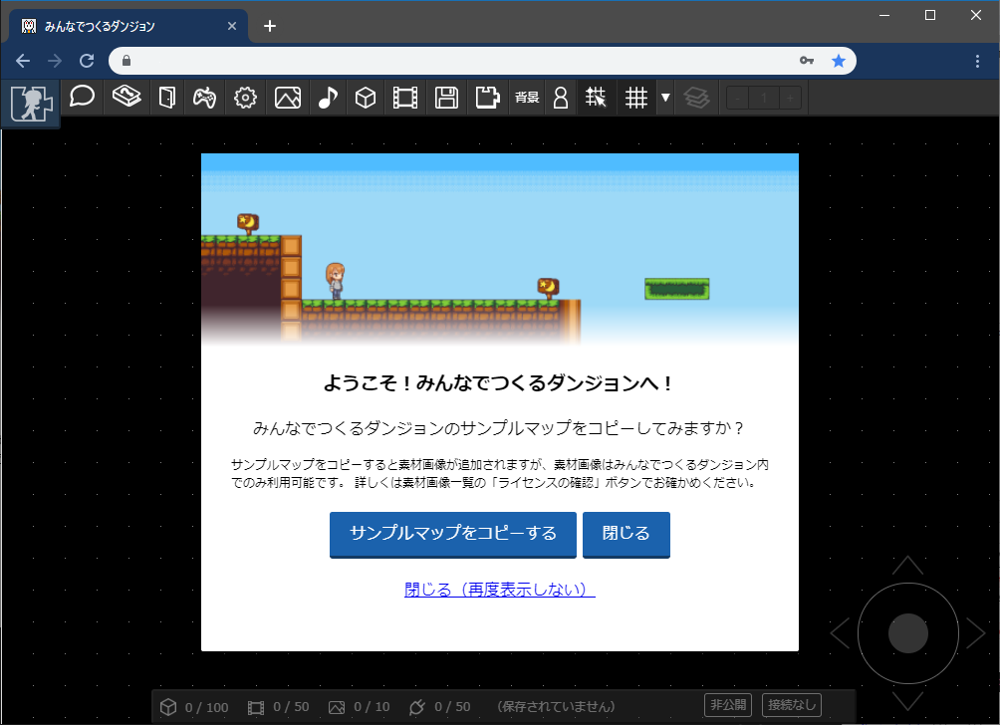
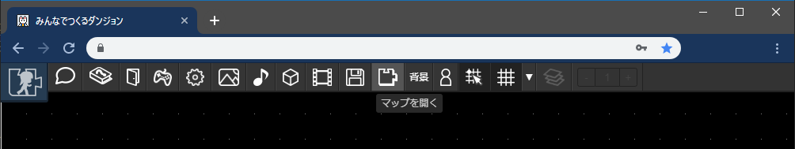
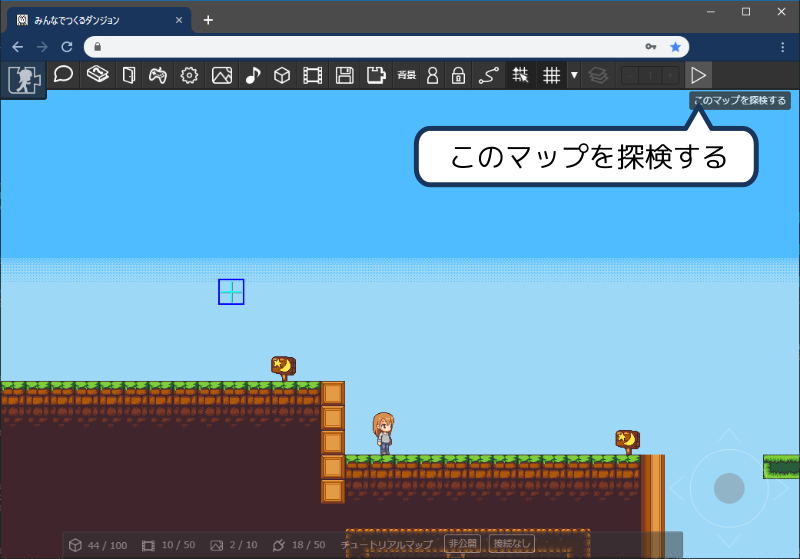
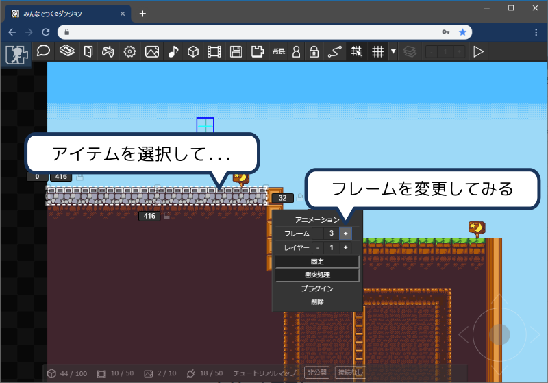
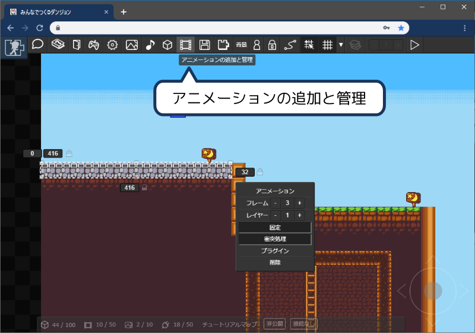
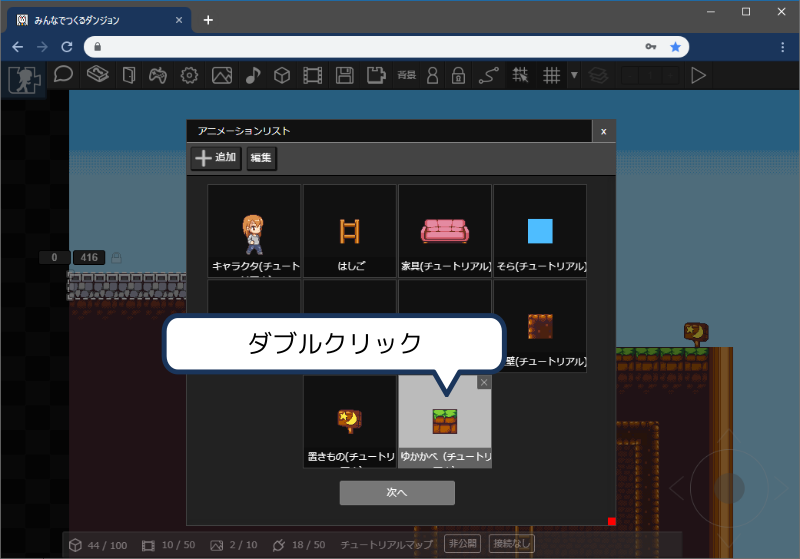
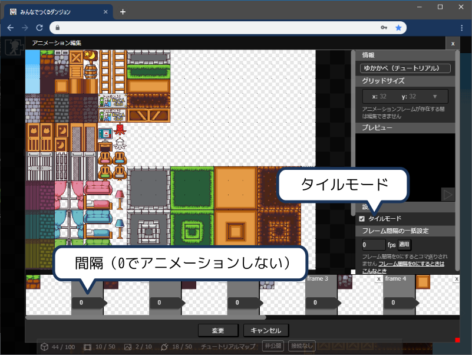
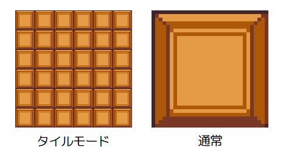
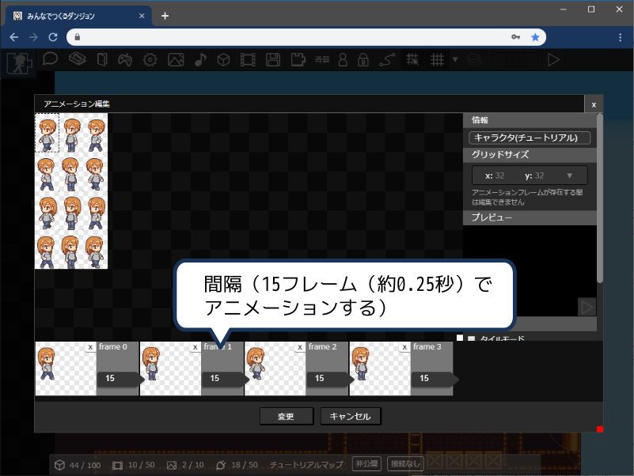

# サンプルマップ

「マップをつくる」モードの初回起動時には「サンプルマップのコピー」機能を利用できます。
マップをつくるには、最低限「[素材画像を登録](/guide/texture/#登録方法)」し、
「[アニメーションを作成](/guide/animation/#アニメーションの新規作成)」し、
「[アイテムを設置](/guide/item/#アイテムの配置)」し...と
いろいろな工程が必要なので、はじめはとっつきにくいかもしれません。

サンプルマップをコピーし、いろいろさわってみることで手軽にマップ制作を体験することができます。

:::tip 編集したサンプルマップの公開
編集したサンプルマップは公開できます。自由に改変してください。
:::

:::warning 注意
サンプルマップに必要な素材画像がコピーされますが、みんなでつくるダンジョンのマップ作成以外では利用できません。改変や再頒布などは禁止です。
:::

## サンプルマップをコピー

表示されるウインドウの「サンプルマップをコピーする」ボタンを押すとコピーが完了します

## マップを読み込む

コピーしたマップは「マップを開く」ボタンから開くことができます。

## 実行してみる

マップをひらいたらとりあえず実行してみましょう。以下のキーをつかってマップを探検します。

| キー | 機能 |
| --- | --- |
| 十字キー | 上下左右に移動します。はしごと重なっているときには上キーがつかえます |
| z | ジャンプ |
| x | 選択（看板を読んだり、キャラに話しかけたり） |

:::tip スマホであそぶとき
スマホでも「公開済みマップ」ならあそべます。（iOS系デバイスでは動作しない不具合があります。現在修正中）
例： [https://dungeon.garakuta-toolbox.com/maps/11](https://dungeon.garakuta-toolbox.com/maps/11)
:::

## アイテムのアニメーションをさわってみる

アイテムのアニメーションを変更してみましょう。マップ上のアイテムを選択して、フレームを変更すると、絵柄がかわります。
このアニメーションの中身を確認してみます。

「アニメーションの追加と管理」からアニメーションを確認できます。

アニメーションをダブルクリックします。

編集画面をみてみると、1枚の画像からいろいろなコマが登録されている様子がわかります。

このアニメーションには「[タイルモード](/guide/animation/#タイルモード)」が設定されているので、アイテムの大きさを変えると画像が並べて表示されます。

また、フレームの間隔が0に設定されています。0のときはコマ送りしないので、先ほどのようにフレームを変更して絵柄を変えることができるようになります。

フレームの間隔を1以上に設定すると、設定したフレーム間隔でコマ送りします。1秒間に60フレームくらい実行されるので、以下の画像の場合はおよそ0.25秒ごとに
フレームが切り替わります。

## アイテムをコピー・ペーストしてみる

## アイテムを配置してみる

## セリフを変更してみる
