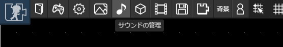

# サウンド

サウンドを登録するとマップにBGMを流すことができるようになります。

## 登録できるサウンドの規格

- OGGのみ
- 2MB以内

## 制限
試験運用の段階なので、以下の制限を設けています。

- 登録できるサウンド数は10個まで

## 登録方法

ツールバーから「サウンド」ボタンを押します。

表示される画像にアップロードしたいサウンドをドラッグアンドドロップすることで登録できます。

## BGMの設定
マップにBGMを設定することができます。詳しくは[マップ#BGM](/guide/map/#bgmの設定)を参照してください。
