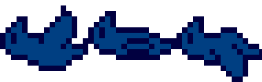

# 画像

画像を登録すると、[アニメーション](/guide/animation/)や[マップチップ・オートタイル](/guide/tiled/)で利用することができます。

## 登録できる画像の規格

- 1MB以内
- 画像フォーマットはPNGのみ（透過PNGをサポートしています）
- 縦、横ともに1500px以内
- 30枚まで登録可能

マップチップ素材については、1チップの幅や高さに制限はありません。1枚の画像に複数の大きさのマップチップがあっても大丈夫です。
また、マップチップのほか、背景素材などなども登録できます。

::: tip サンプル画像について
みんなでつくるダンジョン公式アカウントがサンプル画像を提供しています。ログインした状態で以下のページから入手できます。（以下のページに表示される利用条件に準じてお使いください）

- [https://dungeon.garakuta-toolbox.com/textures/6](https://dungeon.garakuta-toolbox.com/textures/6)
- [https://dungeon.garakuta-toolbox.com/textures/4](https://dungeon.garakuta-toolbox.com/textures/4)

こちらの画像も参考にしてみましょう。
:::

アニメーションを想定した画像は、上記のようにコマすべてが1枚の画像に収まるようにしてください。

## 登録方法

ツールバーから「画像の管理」ボタンを選択します。

表示される画面にアップロードしたい画像をドラッグアンドドロップすることで登録できます。

::: tip 注意
- マップ公開時などに第三者に公開される画像です。第三者に閲覧されると不都合な画像はアップロードしないでください。
- 素材サイトから取得した画像など、第三者が権利を有する画像のアップロードの場合は素材の利用規約に準じてください。
:::

## 削除方法

ツールバーから「画像の管理」ボタンをおして表示されるウインドウの
一覧表示から該当する画像にカーソルを合わせ、表示された「×」ボタンを押すと削除できます。

::: warning 注意
アニメーションに利用されている場合は削除できません。該当するアニメーションを削除してからもう一度お試しください。
:::

## 更新方法
登録済み画像の画像を入れ替えるには、
ツールバーから「画像の管理」ボタンを選択して表示されるウインドウの
一覧表示から該当する画像にカーソルを合わせ、表示された「差し替え」ボタンを押して画像をアップロードします。

::: tip 更新できる画像の条件
差し替える画像と登録済み画像の縦横の大きさが一致している必要があります。
:::

## 公開済み画像のコピー
ほかのユーザーが公開している画像をコピーできます。「コピー」ボタンを押すと利用条件が表示されるので、
同意できる場合のみコピーをしてください。
（利用条件は画像毎に異なるのでご注意ください）

::: tip サンプル画像について
みんなでつくるダンジョン公式アカウントもサンプル画像を提供しています

- [https://dungeon.garakuta-toolbox.com/textures/6](https://dungeon.garakuta-toolbox.com/textures/6)
:::

## 画像の公開
登録した画像を公開すると、[#公開済み画像のコピー](#公開済み画像のコピー) のように、ほかのユーザーが画像をコピーしてみんなでつくるダンジョンのマップ作成に利用できるようになります。

詳しくは[画像素材の公開](/guide/registeration-textures/) をご覧ください。
