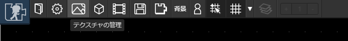
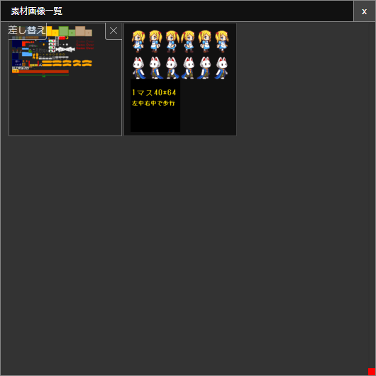

# 画像

画像を登録すると、[アニメーション](/guide/animation/)で利用することができます。

## 登録できる画像の規格

- 1MB以内
- 画像フォーマットはPNGのみ（透過PNGをサポートしています）
- 縦、横ともに1500px以内

## 制限
試験運用の段階なので、以下の制限を設けています。

- 登録できる画像枚数は10枚まで

## 登録方法

ツールバーから「画像の管理」ボタンをおします。

表示される画面にアップロードしたい画像をドラッグアンドドロップすることで登録できます

## 削除方法

ツールバーから「画像の管理」ボタンをおして表示されるウインドウの
一覧表示から該当する画像にカーソルを合わせ、表示された「×」ボタンを押すと削除できます。

::: warning 注意
アニメーションに利用されている場合は削除できません。該当するアニメーションを削除してからもう一度お試しください。
:::

## 更新方法
登録済み画像の画像を入れ替えるには、
ツールバーから「画像の管理」ボタンをおして表示されるウインドウの
一覧表示から該当する画像にカーソルを合わせ、表示された「差し替え」ボタンを押して画像をアップロードします。

::: tip 更新できる画像の条件
差し替える画像と登録済み画像の縦横の大きさが一致している必要があります。
:::
