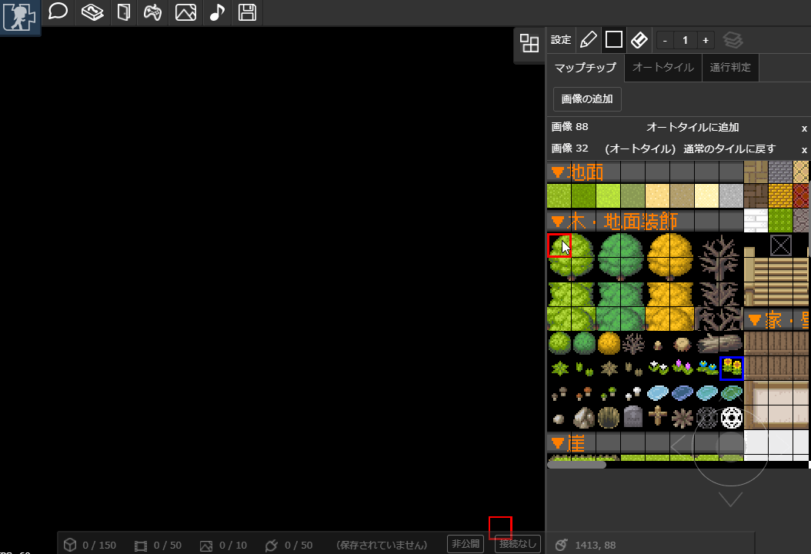
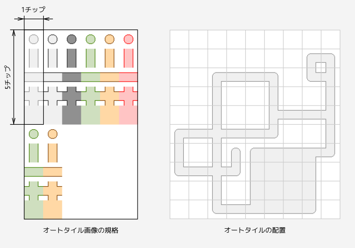
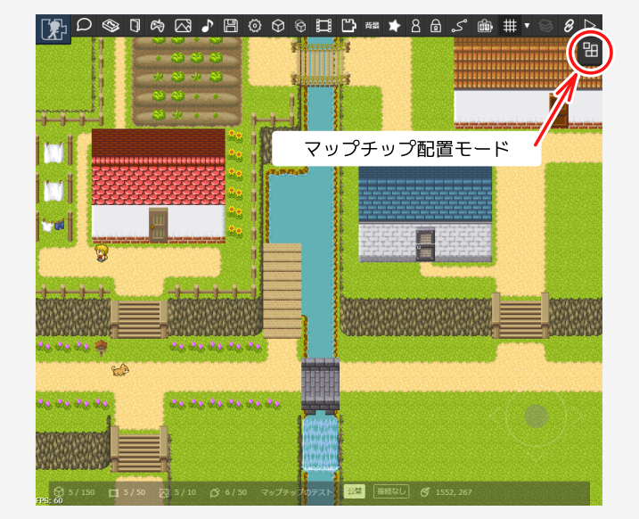
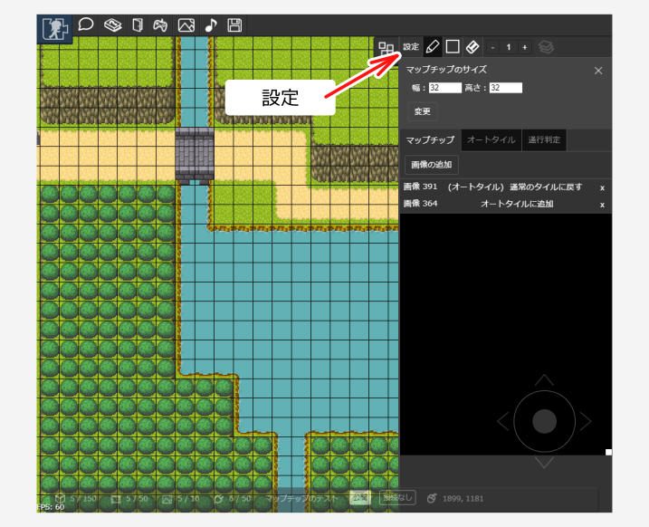
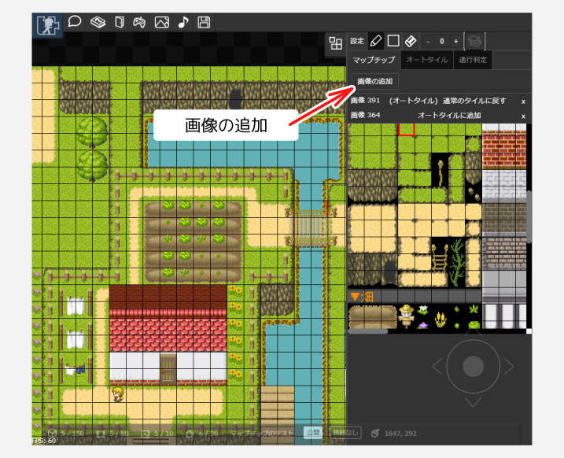
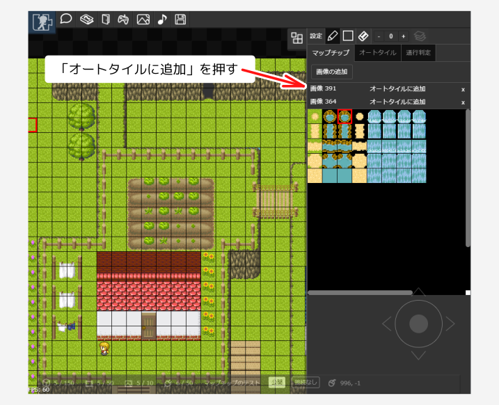
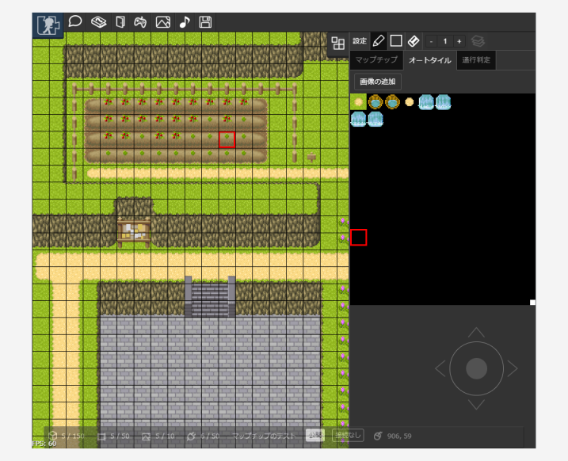
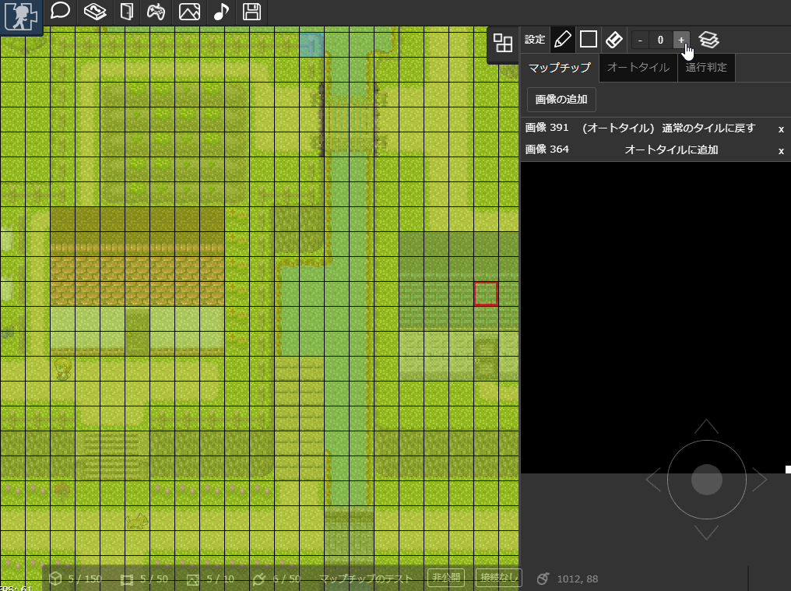
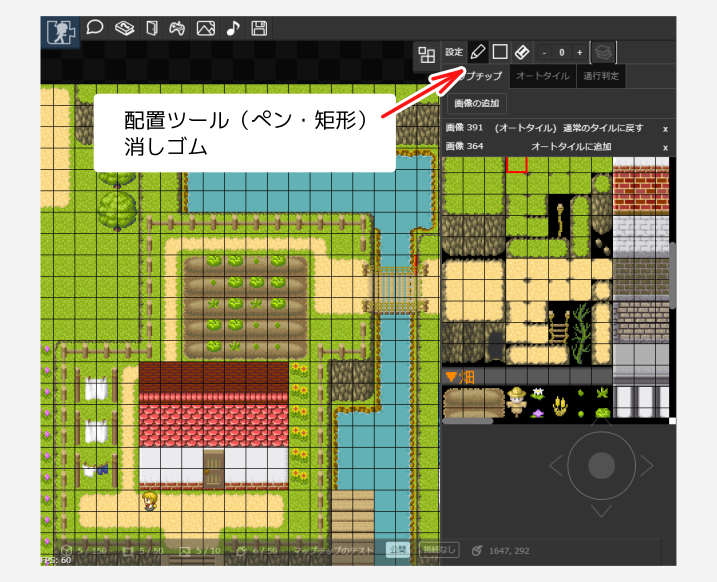
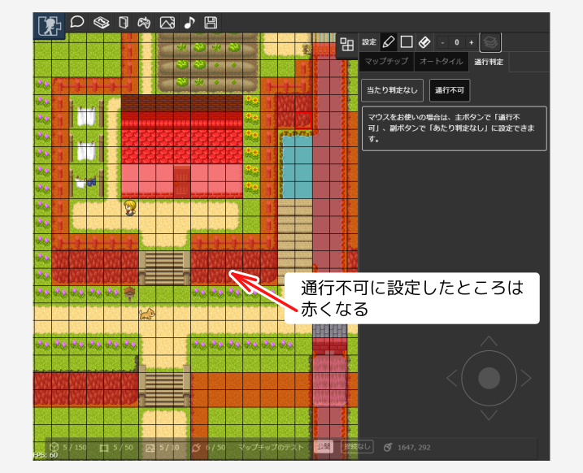

# マップチップ

マップチップを並べてマップをつくることができるようになりました。マップチップでマップをつくった場合でも、これまで通り「パーツ」を配置することもできます。

::: warning 注意
この機能は試験公開中です。不具合などがあったら [不具合報告フォーム](https://docs.google.com/forms/d/e/1FAIpQLSdm7UqFaHVYa363Fp-y2dpc6Uf_M_C6ciI2RxW_IZVvwMt_fQ/viewform?usp=sf_link) や [作者のTwitter](https://twitter.com/piyorinpa) までお知らせください
:::

> 記事中のマップに含まれる素材画像の一部に、ぴぽや様（https://pipoya.net）からお借りしたものを使っています。

::: warning 注意
見下ろしビューモードで動かすことを強くお勧めします。（横スクロールマップだと、当たり判定が上手く動きません）
「見下ろしビュー」のマップを作成する場合は、別途「[見下ろしビューモード](/guide/map/#見下ろしビューモード)」を設定する必要があります。
:::

以下の制限があります。

- マップチップはアニメーションに対応していません
- マップに並べられるマップチップの総数は10000個までです
- 編集操作についてはパソコンでの操作のみサポートしています。（順次スマートフォンにも対応予定）
  - マップであそぶ操作はスマートフォンにも対応しています

## 素材の規格

### マップチップの素材

ファイル形式や画像サイズは[登録できる画像の規格](/guide/texture)に準じています。そのほかの規格は以下の通りです。

- マップチップの最小サイズは16px
- 推奨サイズは32px四方

### オートタイルの素材

オートタイルは以下の形式をサポートしています。

- 縦5チップ、横1チップが1グループになるようにします
- 1グループを縦横に並べると1枚の画像で複数のオートタイルを定義できます

## 編集画面

マップチップを配置するには、「マップチップ配置モード」にします。

## マップチップのサイズ設定

「設定」ボタンからマップチップのサイズを設定できます。マップチップのサイズはすべてのレイヤーで同一になります。

:::warning 注意
- マップチップのサイズを変更するとマップが初期化されます。配置されているマップチップもすべて削除されます。
:::

## マップチップの追加

登録済みの画像を「マップチップ」にします。「マップチップ」タブで「画像の追加」を押します。

:::warning 注意
- マップチップを削除すると、マップから配置したマップチップも削除されます。
- マップチップのもととなる画像を削除すると、マップから配置したマップチップも削除されます。
:::

## オートタイルの追加

「マップチップ」を「オートタイル」に設定します。マップチップタブでオートタイルにしたい画像を選択し、「オートタイルに追加」を押します。

追加されたオートタイルは「オートタイル」タブで確認できます。

オートタイルを削除したい場合は、マップチップタブでオートタイルにしたマップチップの「通常のタイルに戻す」ボタンを押します。

:::warning 注意
オートタイルを削除すると、マップ上にある配置済みのオートタイルが削除されます。
:::

## レイヤーを選択する

合計4つのレイヤーを使うことができます。レイヤー3のみ、キャラクターより手前に表示されます。

- 設定したレイヤーにマップチップを配置できます
- パーツのレイヤーとマップチップのレイヤーはそれぞれ同じレイヤーに属します。レイヤー番号が同じ場合、マップチップの上にパーツが重なって表示されるような描画順になります。
- （以下の動画のように）編集中のレイヤーのみ強調表示したい場合は レイヤーボタン （）を押します。

## マップチップを並べる

マップチップあるいはオートタイルを選択して、マップ上で配置します。

- ペンツールと矩形ツールを選べます
- 配置したマップチップを消したいときは消しゴムを選択します
- マップ上を右クリック（左利き設定の場合は左クリック）することで配置されているマップチップを選択できます（スポイト機能）

## 当たり判定の設定

並べたマップチップに対してあたり判定を設定できます。「通行不可」に設定した領域には立ち入ることができなくなります。

- 「あたり判定なし」または「通行不可」を選びます
  - マップ上を左クリック（左利き設定の場合は右クリック）すると選択した状態を配置できます
- マップ上を右クリック（左利き設定の場合は左クリック）すると通行不可を解除できます
