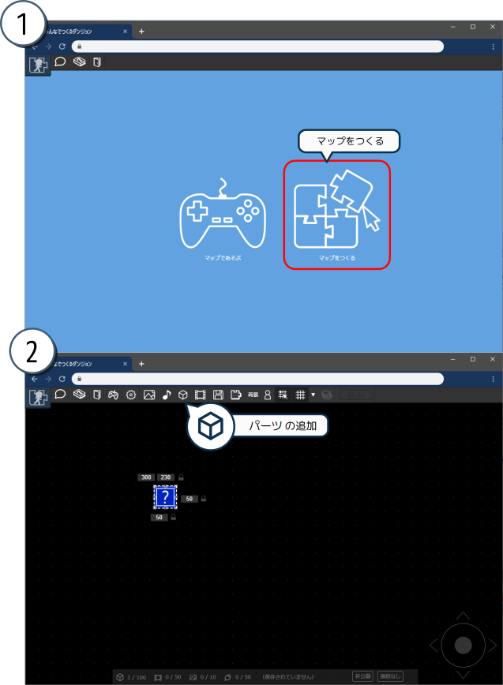
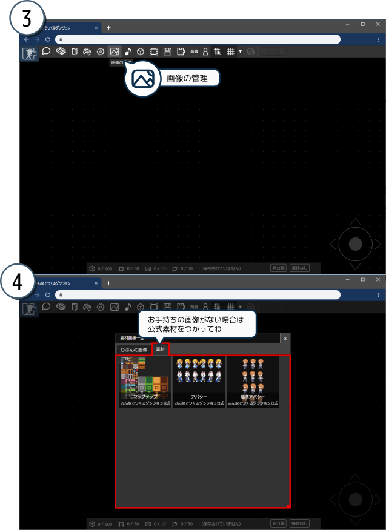
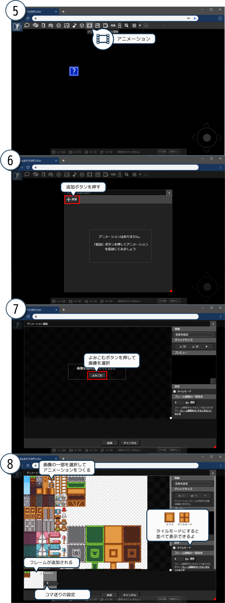
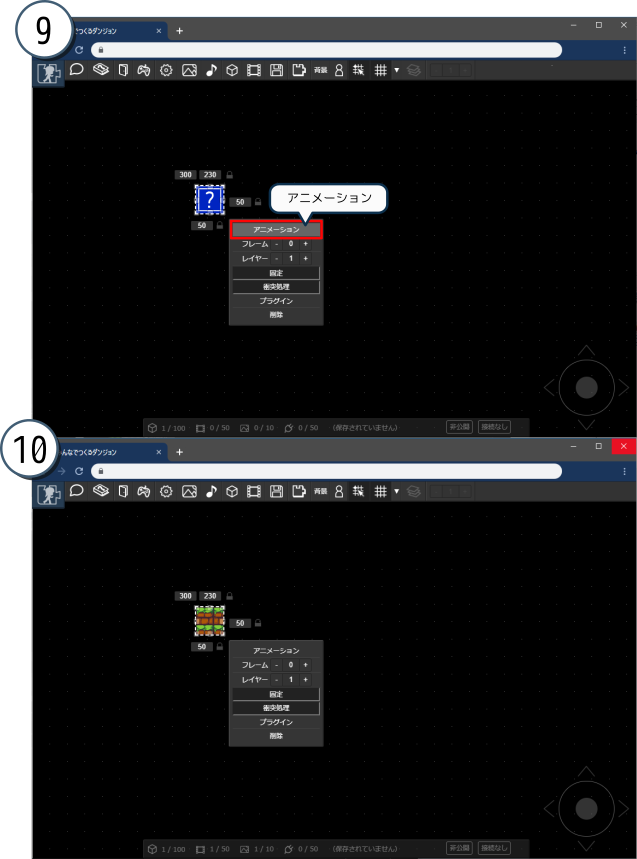
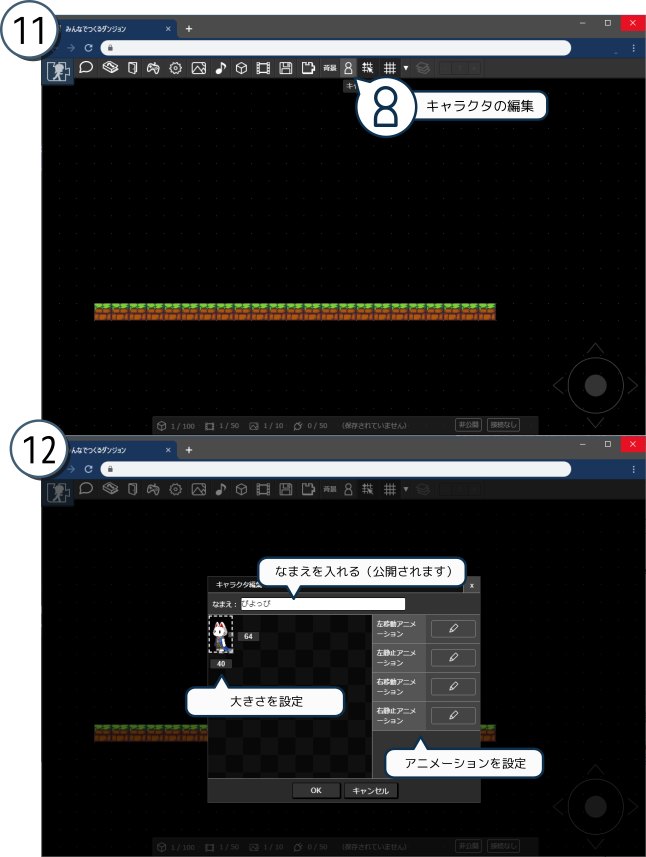
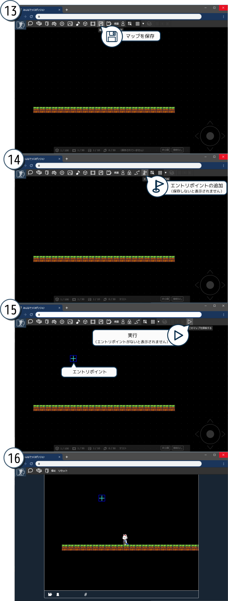
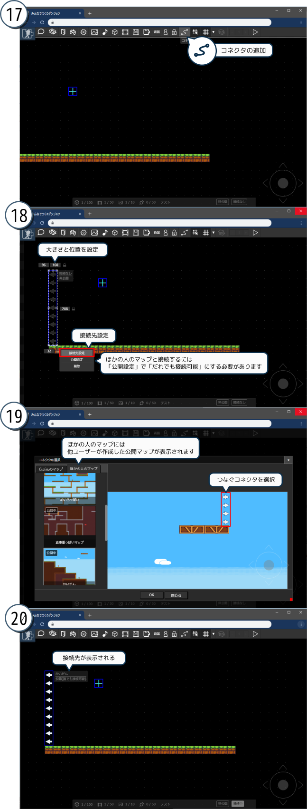

# チュートリアル

## みんなでつくるダンジョンってなに？

アクションゲームのような横視点の二次元マップをつくって公開したり、ほかのひとが作ったマップを探検することができます。
マップ同士はつなげることができるので、どんどんつなげて巨大なダンジョンをつくってあそぼう～！というウェブサービスです。

## マップであそんでみる

まずはマップであそんでみましょう。作者が作ったマップのリンクを貼っておきます。こんな感じのマップが作れるのだな、という雰囲気をつかんでいただけると思います。

- [https://dungeon.garakuta-toolbox.com/maps/1](https://dungeon.garakuta-toolbox.com/maps/1)
- [https://dungeon.garakuta-toolbox.com/maps/14](https://dungeon.garakuta-toolbox.com/maps/14)

このようにマップのリンクを貼ることで、作ったマップをTwitterなどのSNSで共有することができます。
（ログインすれば、マップにつながっている他のマップへ移動できるようになります）

## マップをつくってあそぶ

マップをつくることができます。まずはアカウントを作成し、マップ作成モードにしたうえで、アイテムを配置していきます。

:::tip
マップの作成のようすをYoutubeで公開中です。マップ作成の雰囲気が分かると思うので見てみてください。
[みんなでつくるダンジョンでマップをつくってみたよ](https://youtu.be/5C7XviGnCLw)
:::

はてなマークのアイテムがマップに登場しました。これをつかって床や壁をつくっていきます。アイテムには静止画像やアニメーションを設定できます。
静止画像もアニメーションも「アニメーション」機能でつくるので、次は「アニメーション」機能を触ってみましょう。

画像をアップロードします。もしくは、みんなでつくるダンジョン公式アカウントが提供している画像をコピーします。
（提供している画像は墨cmさまからお借りしているものです。コピーの際に利用規約が表示されるのでご確認ください）

つぎにアニメーションを作成してみましょう。静止画像の場合は1フレーム（コマ）だけのアニメーションを作成するか、[フレーム間隔を0](/guide/animation/)にします。複数のフレームを設定し、フレーム間隔を1以上にすればアニメーションになります。

作成したアニメーションをアイテムに適用します。こんな感じにアイテムを配置してアニメーションを適用、を行いながら、壁や天井などを作り上げていきます。

ついでにキャラクタもつくってみましょう。キャラクタをつくると自分のキャラクターでマップ内を探検できます。
（キャラクタについての詳しい説明は[こちら](/guide/avatar/)）

先ほどと同じ要領でキャラクタ用の画像をアップロードするか、みんなでつくるダンジョン公式アカウントが提供しているキャラクタ用画像をコピーします（こちらも利用規約をご確認ください）。
「左移動」「右移動」「左静止」「右静止」状態のアニメーションをつくり、「キャラクタの編集」にてアニメーションを設定します。

実行してみます。まずはマップを保存します。つぎにエントリポイント（キャラクタの初期位置）を配置し、実行してみましょう。

だいたいこんな感じでマップをつくることができます。

## マップをつなげてあそぶ

作ったマップをじぶんやほかのひとが作ったマップとつなげることができます。
コネクタを配置して、接続先を設定してみましょう。

キャラクターがコネクタに触れると、接続先のマップへと行くことができます。コネクタの詳しい説明についても[ヘルプページ](/guide/connector)を見てみてください。

