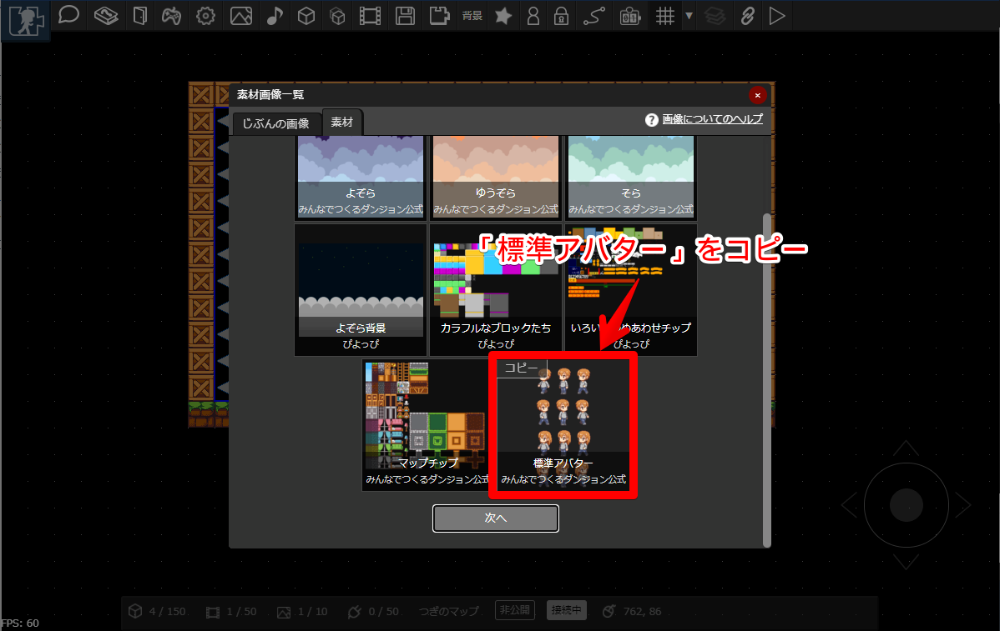
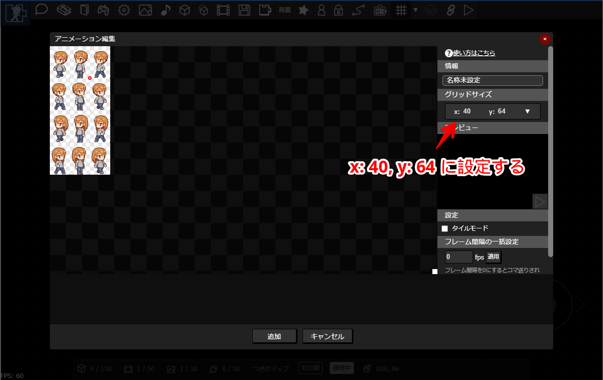
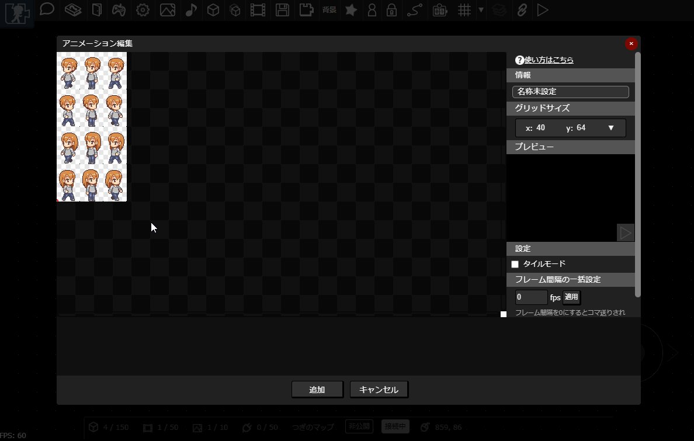
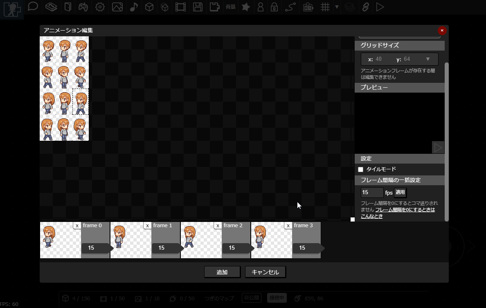
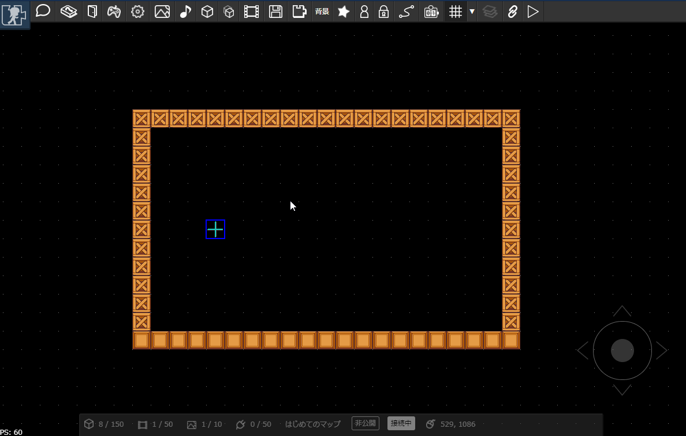
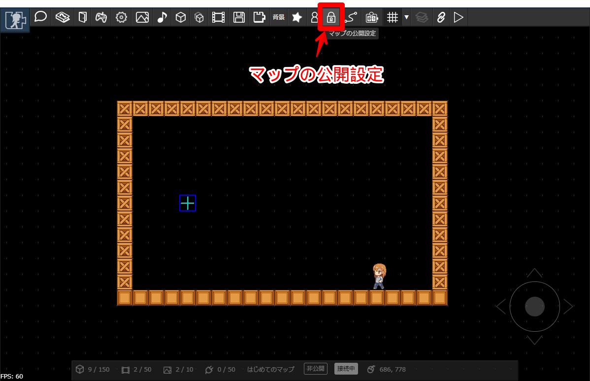
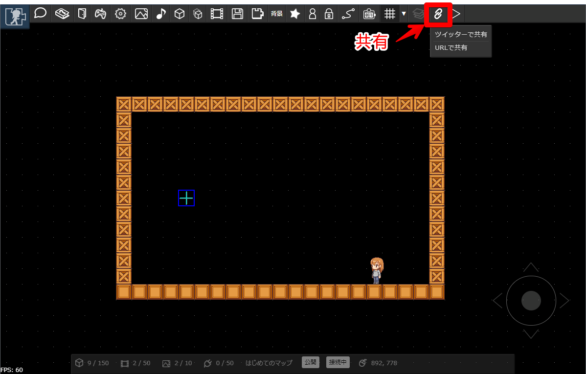

# マップ作成チュートリアル

アクションゲームのような横視点の二次元マップをつくって公開したり、ほかのひとが作ったマップを探検することができます。
マップ同士はつなげることができるので、どんどんつなげて巨大なダンジョンをつくってあそぼう～！というウェブサービスです。

「プラグイン」という仕組みをつかうことで、マップ内に動きを付けることができ、かんたんなゲームっぽいマップをつくることもできます。

まずはマップであそんでみましょう。以下のリンクからマップを遊ぶことができます。こんな感じのマップが作れるのだな、という雰囲気をつかんでいただけると思います。

- [https://dungeon.garakuta-toolbox.com/maps/1](https://dungeon.garakuta-toolbox.com/maps/1)
- [https://dungeon.garakuta-toolbox.com/maps/14](https://dungeon.garakuta-toolbox.com/maps/14)

:::tip ワンポイント
上記のようにマップのリンクを貼ることで、作ったマップをTwitterなどのSNSで共有することができます。
:::

:::tip おしらせ
マップの作成のようすをYouTubeで公開中です。こちらも併せてみてみてください。
[みんなでつくるダンジョンでマップをつくってみたよ](https://youtu.be/5C7XviGnCLw)
:::

## アカウントをつくる
まずはアカウントを作成します。[トップページ](https://dungeon.garakuta-toolbox.com) の以下のボタンからアカウントを作成します。

アカウントを作成すると、以下のことができるようになります。

- マップをつくって公開できます
- [キャラクタ](../avatar/)をカスタマイズしてマップ内をたんけんできます
- [アイテム](../item-collection)を拾ったり、[いいねカウンタ](../counter/)が設置されているマップでいいねできます
- [素材を公開](../registeration-textures/)できます

## ログインする

登録が終わったら、ログインをします。[ログイン画面はこちら](https://dungeon.garakuta-toolbox.com/maps)

ログインしたら、「マップをつくる」を選びます。

マップの編集画面が表示されます。マップは左下のスティックでスクロールできます。PCの場合は、Sキーを推しながらマウスカーソルを移動させてもスクロールできます。

## パーツを置く

まずは「パーツ」を配置してみましょう。パーツを並べることで、マップの床や壁などをつくります。
マップのあらゆるものはパーツを配置して作り上げます。

「パーツの追加」ボタンを押すと、マップ上にはてなマークのパーツがひとつ追加されます。

---

パーツはマウス（スマートフォンの場合はタッチ）のドラッグ操作あるいは、パーツの周囲に表示されている数字を書き換えることで、大きさや位置を変更できます。

## 画像をアップロードする

パーツに[アニメーション](../animation/)を設定することで、静止画やアニメーションを設定できます。
アニメーションを作るには画像が必要なので、まずは画像を用意します。

「画像の管理」ボタンを押します。

---

お手持ちの画像がなくても、公開されている素材をつかうことができます。
今回は、公式素材の「マップチップ」を選択してみましょう。
表示された画面の「素材」タブを選択し、「マップチップ」という素材を選択して「コピー」ボタンを押します。

コピーボタンは、PCの場合は対象の素材の上にマウスカーソルを置いたとき、スマートフォンの場合は対象の素材をタップしたときに表示されます。

:::warning 注意
コピーの際に素材の利用条件が表示されるので、確認しておきましょう。
:::

---

コピーが完了すると、「じぶんの画像」一覧にコピーした画像が表示されます。

:::tip ライセンスの確認
コピーした画像には「ライセンスの確認」ボタンが表示されます。利用条件を改めて確認したいときに押してみてください。
:::

:::tip じぶんの画像をつかうとき

表示された画面で、画像の追加ボタンを押すか、ファイルをドラッグ＆ドロップします。

素材の規格については、[画像](../texture/)を見てみてください。
:::

## アニメーションをつくる

アニメーションを作成してみましょう。まずは「アニメーション」ボタンを押します。

---

以下の手順でアニメーションを追加し、アニメーションに利用する画像を読み込みます。

---

アニメーションの一コマを「フレーム」といいます。画像をドラッグ＆ドロップしてフレームを追加してみましょう。

---

名前を変更して、追加ボタンを押します。

## アニメーションの適用

作成したアニメーションをパーツに適用します。以下のようにパーツを選択し、アニメーションを設定します。
パーツのサイズを変更すると、アニメーションもそのぶん伸び縮みします。

## アニメーションのタイルモード

アニメーションに「タイルモード」を設定しておくと、パーツを拡大したときにアニメーションを並べて表示できます。
以下のように、「アニメーション」ボタンを押し、先ほど追加したアニメーションを選択して「編集」ボタンを押します。「タイルモード」にチェックを入れて変更すると、
タイルモードが適用されます。

タイルモードを適用したアニメーションは、パーツを大きくしたときに画像が並べて表示されます。床や壁をつくるときに便利です。

---

パーツを4つつかって床や壁をつくってみましょう。
似たようなパーツを作るときには、コピー・貼り付けをすると楽にパーツを複製できます。アイテムを選択した状態で、以下の画像の「コピー」ボタンを押すとコピーでき、
「貼り付け」ボタンを押すと複製されます。

:::tip ワンポイント
PCの場合は「Ctrl+C」でコピー、「Ctrl+V」で貼り付けることができます。
:::

## アニメーションをもっとつかってみる

フレームを複数設定すれば、動きのあるアニメーションを作れます。

先ほどと同じ手順で、「標準アバター」素材をコピーしてみましょう。

---

コピーしたら、アニメーションを作ります。先ほどと同様の手順でアニメーション作成画面を表示し、コピーした「標準アバター」素材画像を読み込みます。

アバター画像の1コマのサイズは縦60px, 横40px なので、グリッドサイズを x:40px y:60px に設定します。

:::tip ワンポイント
グリッドサイズを調整することで、任意の大きさに画像を切り抜けます。
:::

---

次のようにフレームを追加します。さらに、「フレーム間隔の一括設定」機能をつかって、15fps毎にコマ送りするように一括設定します。

---

ためしにアニメーションを再生してみましょう。「プレビュー」の再生ボタン（三角ボタン）を押すと、アニメーションを再生できます。

フレーム間隔を調整して、よい感じの速度になるように調整してみましょう。

---

アニメーションを作成したら、パーツを追加して適用してみましょう。

:::tip ワンポイント
上記の動画のように、カギマークを押すことで位置や大きさが意図せず変更されないようにロックできます。
:::

## アニメーションの便利な機能

床の画像を変更してみましょう。新しくアニメーションを一つ追加してもよいですが、今回は別の方法を試してみます。

以下のように、先ほど作ったアニメーションにいくつかコマを追加してみます。すると、コマが一定間隔で入れ替わり、アニメーションになっていることがわかります。

---

つぎに、再び先ほどのアニメーションを設定します。「フレーム間隔の一括設定」でフレーム間隔を0に設定します。
フレーム間隔とは、次のフレームに切り替えるまでの時間のことですが、0に設定することで次のフレームに切り替わらなくなります。

---

パーツを選択し、フレームを切り替えることで、表示するコマを設定できます。これで床の画像だけを変更できました。

この方法を使えば、たくさんアニメーションを作らなくても
かんたんに静止画像を管理できます。パーツのコピー＆ペースト機能と組み合わせることで、よりすばやくマップをつくることもできます。

## マップをたんけんしてみる

つくったマップをたんけんしてみましょう。まずはマップを保存します。PCの場合は「Ctrl+S」キーでも保存できます。

---

マップを1度でも保存したら、たんけんの開始地点である「エントリポイント」を設置できます。
（エントリポイントはマップにただ一つだけ配置できます）

---

エントリポイントを設置すると、「保存してたんけん」ボタンを押すことできるようになります。

---

先ほど設置したエントリポイントからキャラクタが出現します。キャラクタは十字キーで動かすことができます。Zキーでジャンプもできます。

## プラグインをつかってみる

パーツに「[プラグイン](../plugin/)」を適用すると、パーツに動きをつけることができます。

マップにちょっと手を加えて、新たにパーツを配置します。これまでの手順を踏まえて、アニメーションを作ったり、パーツにアニメーションを適用したりしてみましょう。
これからプラグインを活用してパーツを上下に動かして、エレベータのような動きをつくってみます。

---

パーツを選択し、「プラグイン」をクリックします。

---

プラグイン設定画面が表示されます。今回は、「直線往復移動」プラグインをつかいます。プラグインリストから「直線往復移動」を選択し、画像のように設定し、OKボタンを押します。

:::tip 設定値について
設定値の意味は以下の通りです
- 縦方向に-100の速度で動かす
- 横方向に0の速度で動かす（つまり動かさない）
- 150pxだけ移動させる

マップは左隅を原点として、右向きにX軸、下向きにY軸を取っています。なので、上向きに動かしたい場合は速度は負号をとります。
:::

---

この状態でマップを保存してたんけんしてみます。先ほどプラグインを適用したパーツが上下方向に動いています。

:::tip ワンポイント
ほかにもいろいろなプラグインがあります。[プラグイン](../plugin/) もみてみてください。たとえば以下のようなこともできます。

- メッセージの表示
- はしご
- 一方通行

プラグインを紹介するマップもあります。ぜひ見てみてください

[https://dungeon.garakuta-toolbox.com/maps/237](https://dungeon.garakuta-toolbox.com/maps/237)

:::

## マップをつなげてあそぶ

作ったマップをじぶんやほかのひとが作ったマップとつなげることができます。今回はじぶんのマップとつなげてみましょう。

まずは、マップに[コネクタ](../connector/)を配置します。コネクタをつかって他のマップと接続します。
キャラクタがコネクタに接触すると、設定したマップに移動します。

今回は「右」向きのコネクタを設置します。コネクタには向きがあり、「右」向きのコネクタは「左」向きのコネクタと接続できます。
また、「上」向きのコネクタは「下」向きのコネクタと接続できます。

---

コネクタもパーツと同様に、ドラッグ＆ドロップで移動したりサイズ変更できます。

---

次に、接続先のマップをつくってみましょう。
既にマップを開いている場合は、次の手順でマップを新規作成できます。

マップを新規作成します。マップを開くボタンを押します。

---

リスト内の「新規作成」を選択してOKボタンを押すと、マップが新規作成されます。

:::tip ワンポイント
上記では既にマップを開いている状態から新規作成する手順を解説しましたが、
ログイン直後のまっさらなマップも新規作成状態です。
:::

---

新規作成したマップにもコネクタを設置します。今回は「左」向きのコネクタを設置します。

---

コネクタの位置や大きさを調整します。ついでにエントリポイントも設置しておきます。

:::warning 注意
エントリポイントを設置していないマップとの接続はできません。
:::

---

先ほど設置したマップと接続してみましょう。以下のようにコネクタを選択し、「接続先設定」を押すと設定画面が表示されます。「じぶんのマップ」タブ内のリストから、接続先のマップを選択し、さらにコネクタを選択してOKボタンを押すと、接続が完了します。

コネクタの接続が完了すると、コネクタの矢印の色が濃く表示されます。

---

接続したら、ためしにマップをたんけんしてみましょう。先ほど設定したコネクタに触れると、接続したマップへジャンプできます。

## マップを公開する

マップを公開すると、URLをブログやSNSで共有できるようになります。マップの公開設定ボタンを押し、公開状態にします。

---

公開されている状態のマップは「共有」を押すと、ツイッターで共有もしくはマップの公開URLをコピーできます。

