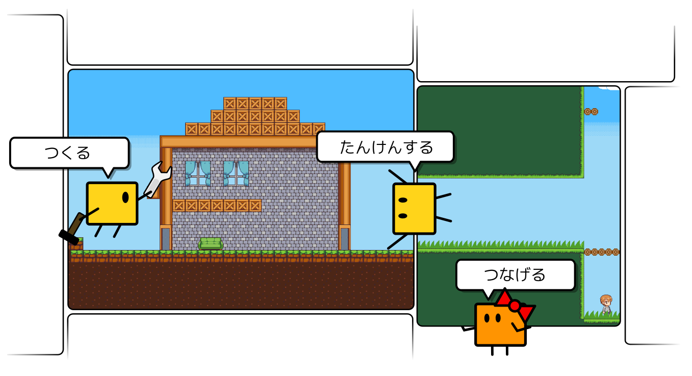

# マップ作成チュートリアル

## みんなでつくるダンジョンとは

アクションゲームのような横視点の二次元マップをつくって公開したり、ほかのひとが作ったマップを探検することができます。
マップ同士はつなげることができるので、どんどんつなげて巨大なダンジョンをつくってあそぼう～！というウェブサービスです。

「プラグイン」という仕組みをつかうことで、マップ内に動きを付けることができ、かんたんなゲームっぽいマップをつくることもできます。

## マップであそんでみる

まずはマップであそんでみましょう。以下のリンクからマップを遊ぶことができます。こんな感じのマップが作れるのだな、という雰囲気をつかんでいただけると思います。

- [https://dungeon.garakuta-toolbox.com/maps/1](https://dungeon.garakuta-toolbox.com/maps/1)
- [https://dungeon.garakuta-toolbox.com/maps/14](https://dungeon.garakuta-toolbox.com/maps/14)

:::tip ワンポイント
上記のようにマップのリンクを貼ることで、作ったマップをTwitterなどのSNSで共有することができます。
:::

## チュートリアルをすすめる

左側のメニューを上から順番に進めることで、みんなでつくるダンジョンの一通りの機能に触れることができます。

:::tip おしらせ
マップの作成のようすをYouTubeで公開中です。こちらも併せてみてみてください。
[みんなでつくるダンジョンでマップをつくってみたよ](https://youtu.be/5C7XviGnCLw)

<iframe width="560" height="315" src="https://www.youtube.com/embed/90dTCJ7Esfk" frameborder="0" allow="accelerometer; autoplay; encrypted-media; gyroscope; picture-in-picture" allowfullscreen></iframe>

:::

