# アニメーションをつくる

[前回の手順](../upload-image/)でコピーした画像を使って、アニメーションをつくってみましょう。

## アニメーションをつくる

アニメーションを作成してみましょう。まずは「アニメーション」ボタンを押します。

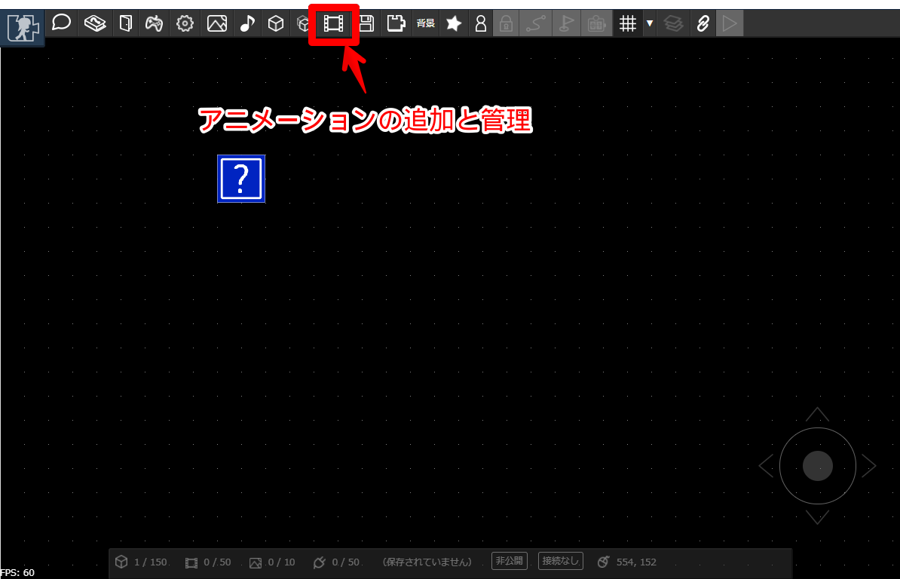

---

以下の手順でアニメーションを追加し、アニメーションに利用する画像を読み込みます。

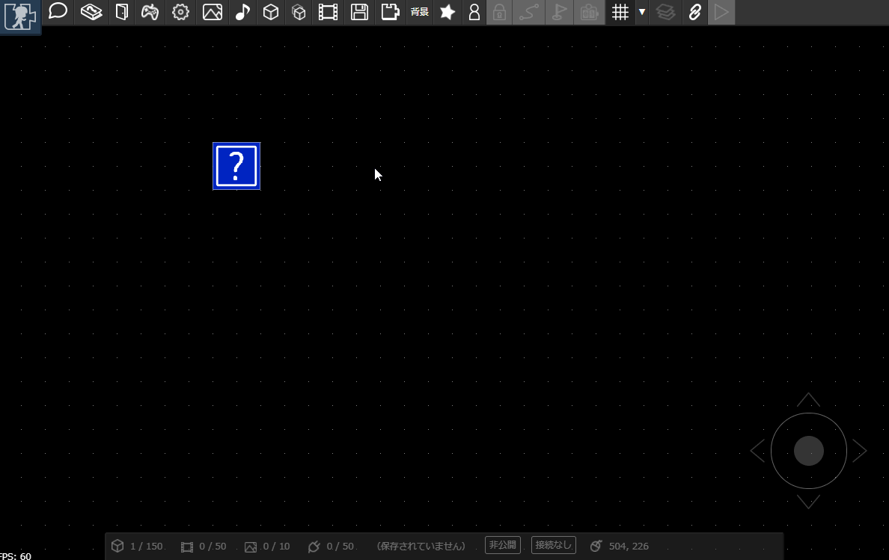

---

アニメーションの一コマを「フレーム」といいます。画像をドラッグ＆ドロップしてフレームを追加してみましょう。

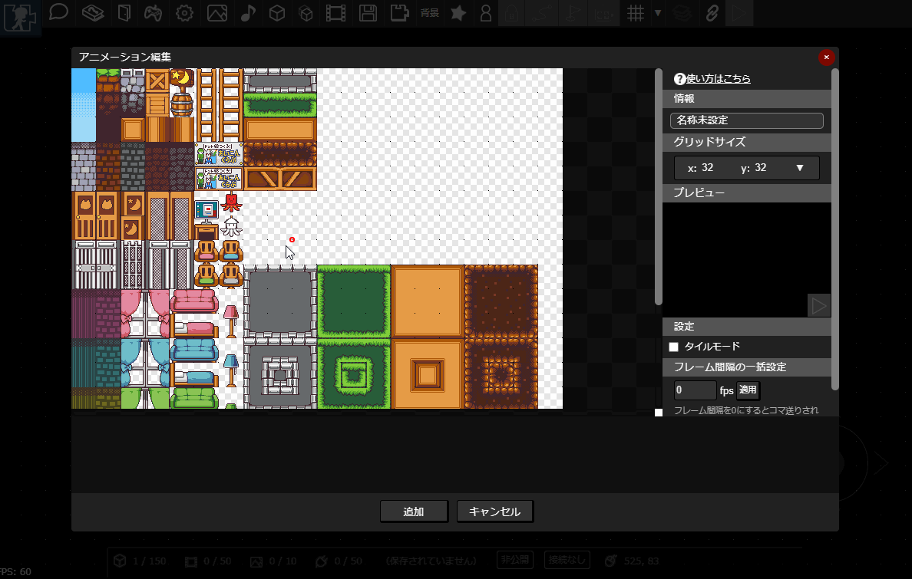

---

名前を変更して、追加ボタンを押します。

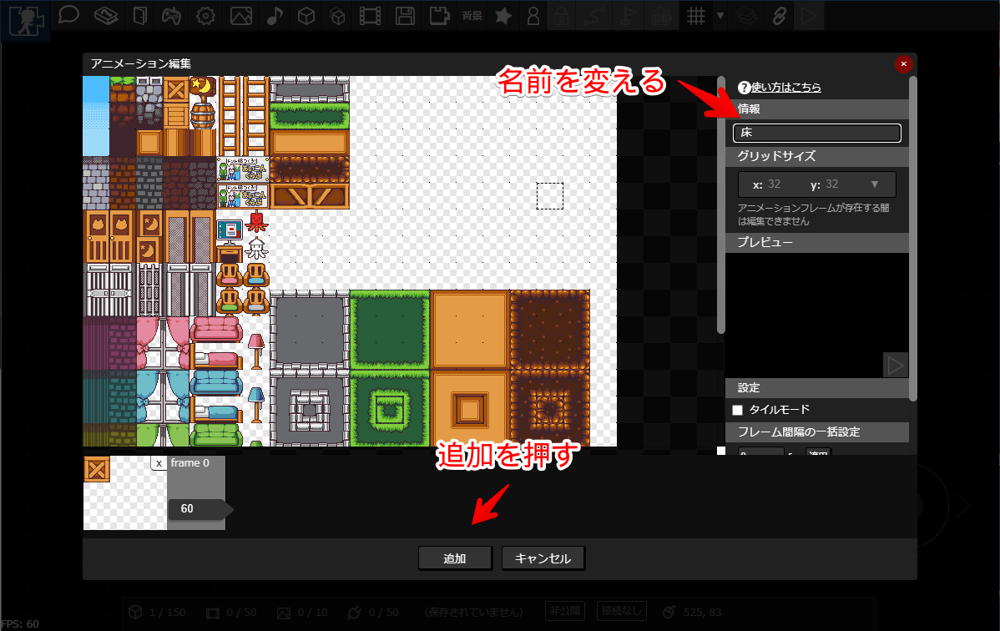

## アニメーションの適用

作成したアニメーションをパーツに適用します。以下のようにパーツを選択し、アニメーションを設定します。
パーツのサイズを変更すると、アニメーションもそのぶん伸び縮みします。

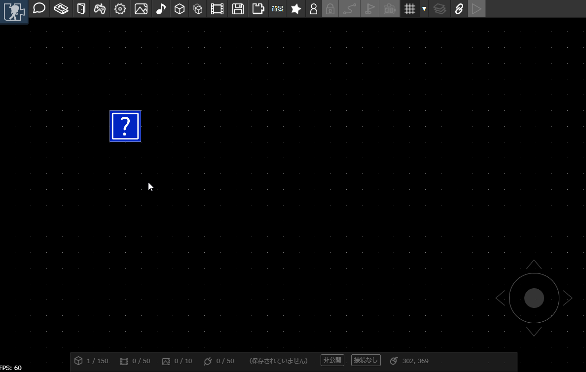

## アニメーションのタイルモード

アニメーションに「タイルモード」を設定しておくと、パーツを拡大したときにアニメーションを並べて表示できます。
以下のように、「アニメーション」ボタンを押し、先ほど追加したアニメーションを選択して「編集」ボタンを押します。「タイルモード」にチェックを入れて変更すると、
タイルモードが適用されます。

タイルモードを適用したアニメーションは、パーツを大きくしたときに画像が並べて表示されます。床や壁をつくるときに便利です。

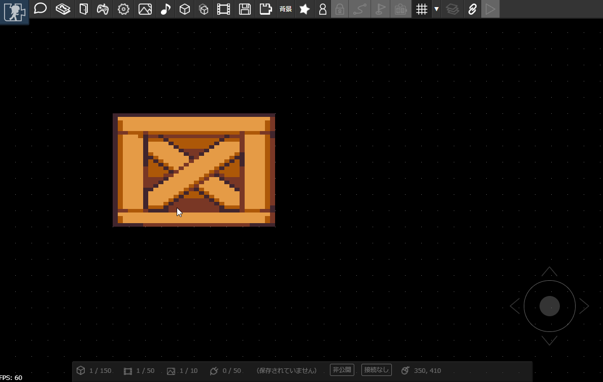

---

パーツを4つつかって床や壁をつくってみましょう。
似たようなパーツを作るときには、コピー・貼り付けをすると楽にパーツを複製できます。アイテムを選択した状態で、以下の画像の「コピー」ボタンを押すとコピーでき、
「貼り付け」ボタンを押すと複製されます。

:::tip ワンポイント
PCの場合は「Ctrl+C」でコピー、「Ctrl+V」で貼り付けることができます。
:::

## アニメーションをもっとつかってみる

フレームを複数設定すれば、動きのあるアニメーションを作れます。

先ほどと同じ手順で、「標準アバター」素材をコピーしてみましょう。

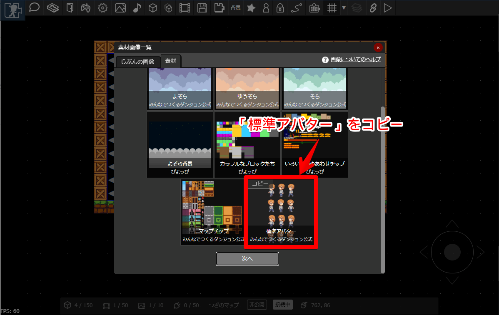

---

コピーしたら、アニメーションを作ります。先ほどと同様の手順でアニメーション作成画面を表示し、コピーした「標準アバター」素材画像を読み込みます。

アバター画像の1コマのサイズは縦60px, 横40px なので、グリッドサイズを x:40px y:60px に設定します。

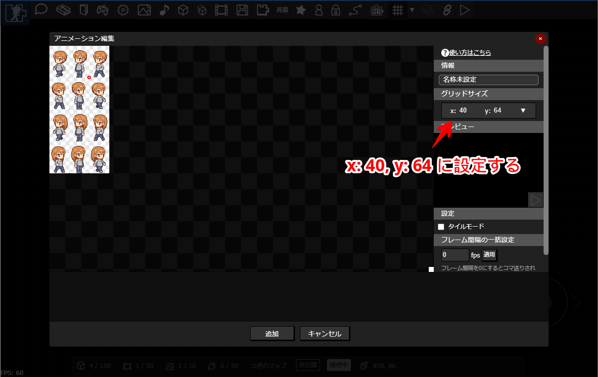

:::tip ワンポイント
グリッドサイズを調整することで、任意の大きさに画像を切り抜けます。
:::

---

次のようにフレームを追加します。さらに、「フレーム間隔の一括設定」機能をつかって、15fps毎にコマ送りするように一括設定します。

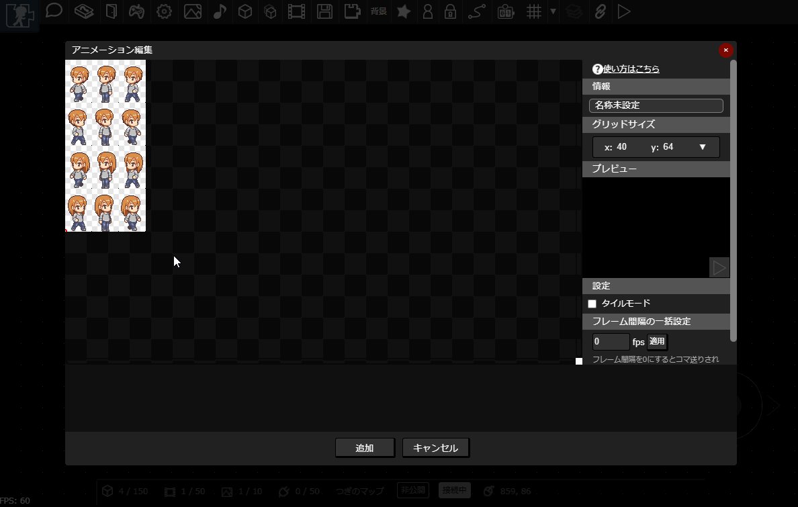

---

ためしにアニメーションを再生してみましょう。「プレビュー」の再生ボタン（三角ボタン）を押すと、アニメーションを再生できます。

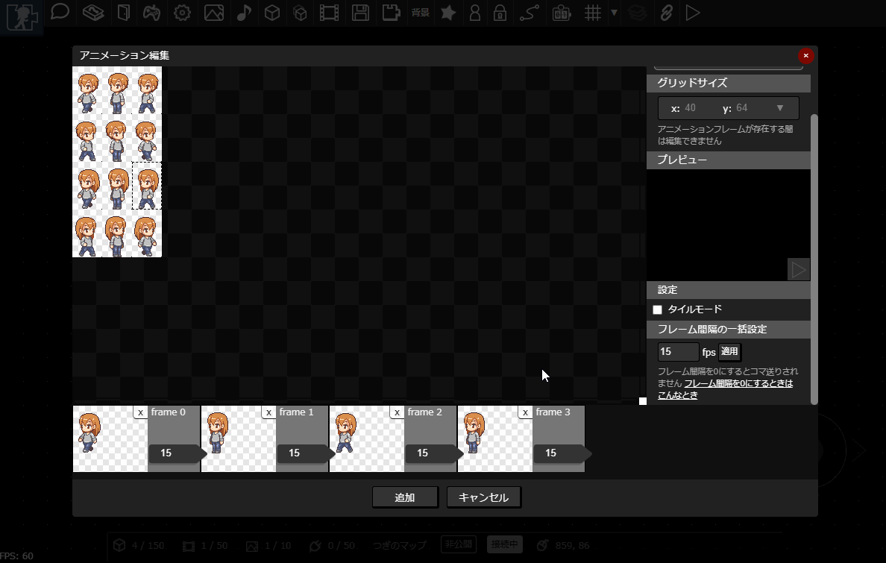

フレーム間隔を調整して、よい感じの速度になるように調整してみましょう。

---

アニメーションを作成したら、パーツを追加して適用してみましょう。

:::tip ワンポイント
上記の動画のように、カギマークを押すことで位置や大きさが意図せず変更されないようにロックできます。
:::

## アニメーションの便利な機能

床の画像を変更してみましょう。新しくアニメーションを一つ追加してもよいですが、今回は別の方法を試してみます。

以下のように、先ほど作ったアニメーションにいくつかコマを追加してみます。すると、コマが一定間隔で入れ替わり、アニメーションになっていることがわかります。

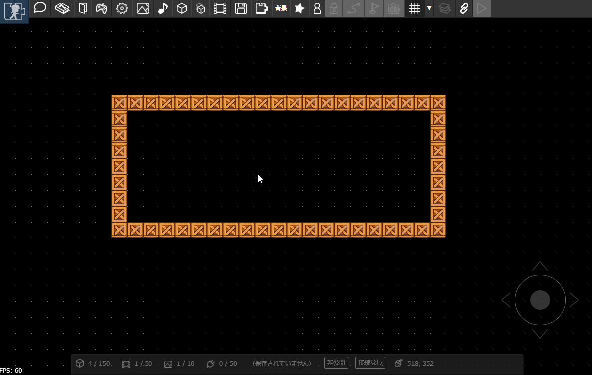

---

つぎに、再び先ほどのアニメーションを設定します。「フレーム間隔の一括設定」でフレーム間隔を0に設定します。
フレーム間隔とは、次のフレームに切り替えるまでの時間のことですが、0に設定することで次のフレームに切り替わらなくなります。

---

パーツを選択し、フレームを切り替えることで、表示するコマを設定できます。これで床の画像だけを変更できました。

この方法を使えば、たくさんアニメーションを作らなくても
かんたんに静止画像を管理できます。パーツのコピー＆ペースト機能と組み合わせることで、よりすばやくマップをつくることもできます。

