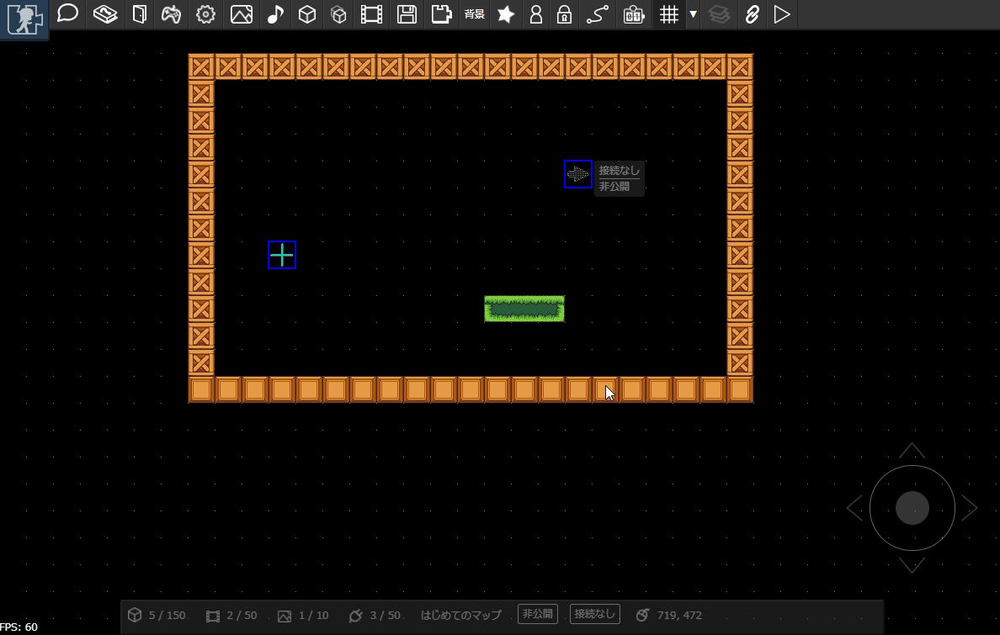

# マップをつなげてあそぶ

作ったマップをじぶんやほかのひとが作ったマップとつなげることができます。今回はじぶんのマップとつなげてみましょう。

## コネクタを置いてみる

まずは、マップに[コネクタ](../connector/)を配置します。コネクタをつかって他のマップと接続します。
キャラクタがコネクタに接触すると、設定したマップに移動します。

今回は「右」向きのコネクタを設置します。コネクタには向きがあり、「右」向きのコネクタは「左」向きのコネクタと接続できます。
また、「上」向きのコネクタは「下」向きのコネクタと接続できます。

---

コネクタもパーツと同様に、ドラッグ＆ドロップで移動したりサイズ変更できます。

---

## 接続先のマップをつくる

次に、接続先のマップをつくってみましょう。
既にマップを開いている場合は、次の手順でマップを新規作成できます。

マップを新規作成します。マップを開くボタンを押します。

---

リスト内の「新規作成」を選択してOKボタンを押すと、マップが新規作成されます。

:::tip ワンポイント
上記では既にマップを開いている状態から新規作成する手順を解説しましたが、
ログイン直後のまっさらなマップも新規作成状態です。
:::

## もう一つのマップにもコネクタを置く

新規作成したマップにもコネクタを設置します。今回は「左」向きのコネクタを設置します。

---

コネクタの位置や大きさを調整します。ついでにエントリポイントも設置しておきます。

:::warning 注意
エントリポイントを設置していないマップとの接続はできません。
:::

## ふたつのマップを接続する

先ほど設置したマップと接続してみましょう。以下のようにコネクタを選択し、「接続先設定」を押すと設定画面が表示されます。「じぶんのマップ」タブ内のリストから、接続先のマップを選択し、さらにコネクタを選択してOKボタンを押すと、接続が完了します。

コネクタの接続が完了すると、コネクタの矢印の色が濃く表示されます。

---

接続したら、ためしにマップをたんけんしてみましょう。先ほど設定したコネクタに触れると、接続したマップへジャンプできます。

