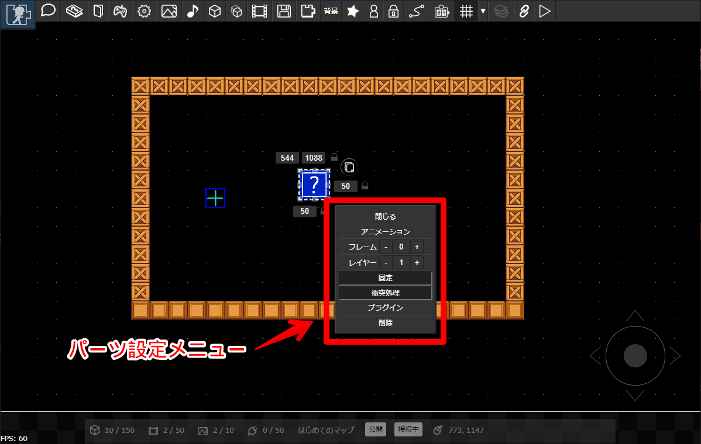
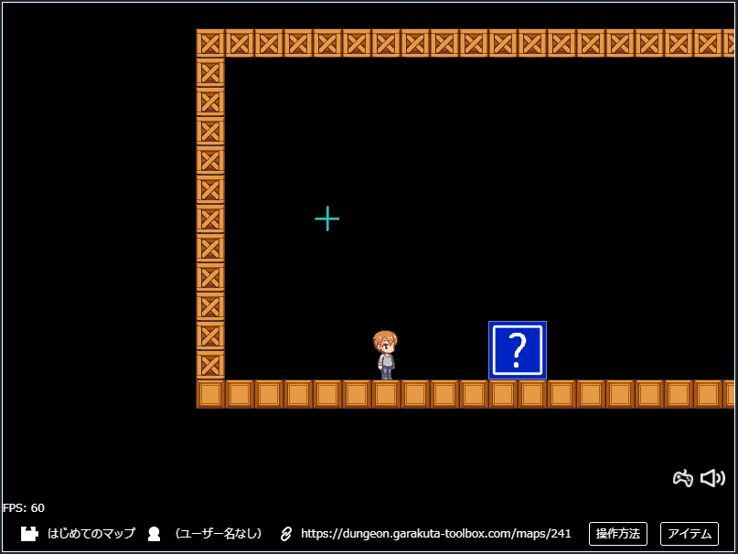
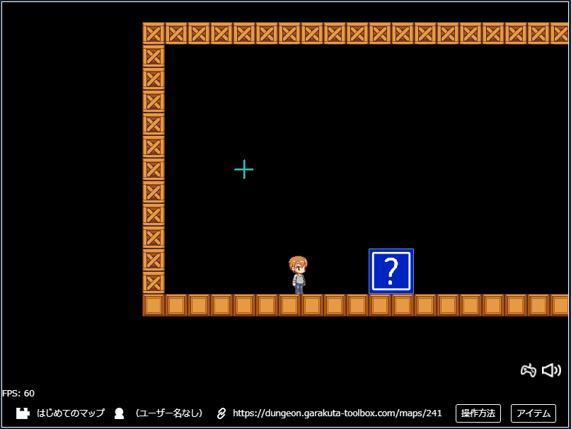
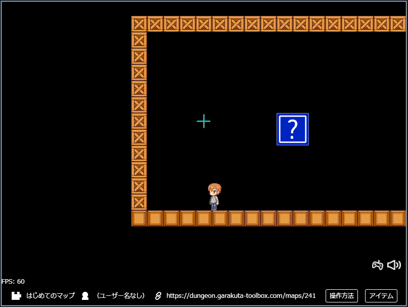
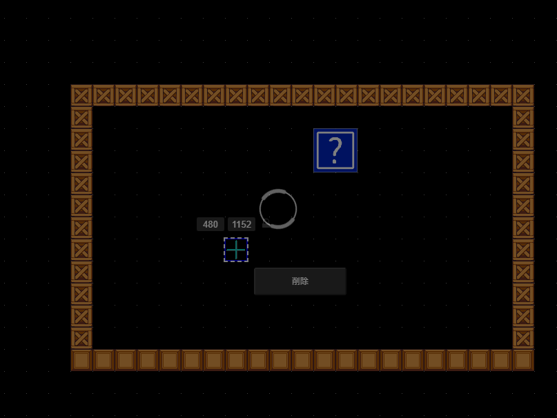

## パーツの設定

パーツの各種設定は、パーツを選択したときに表示されるメニューから行います。

## 衝突処理

パーツの「衝突処理」をONにすると、キャラクタがぶつかったときにパーツにめりこみません。

パーツの「衝突処理」をOFFにすると、キャラクタがぶつかってもすりぬけます。

## 固定

パーツを「固定」すると、重力によって落下しません（固定しないと落下します）。また、キャラクタが押したときも動きません。

パーツを「固定」しないと、重力によって落下します。衝突処理が有効な場合は、キャラクタが押したときにパーツも移動します。

