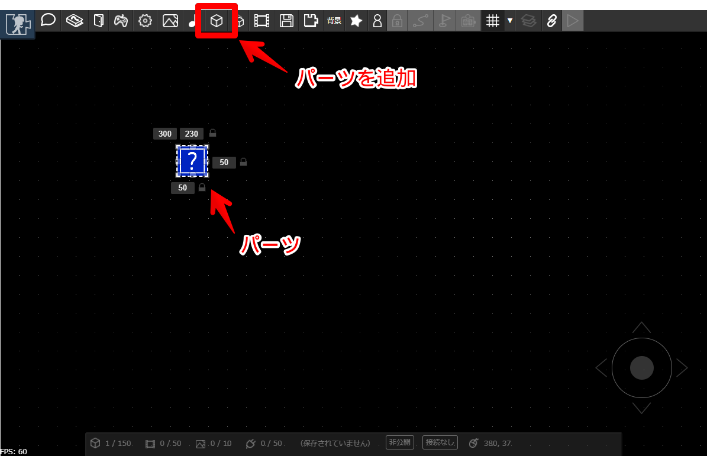

# パーツを置く

まずは「パーツ」を配置してみましょう。パーツを並べることで、マップの床や壁などをつくります。
マップのあらゆるものはパーツを配置して作り上げます。

「パーツの追加」ボタンを押すと、マップ上にはてなマークのパーツがひとつ追加されます。

---

パーツはマウス（スマートフォンの場合はタッチ）のドラッグ操作あるいは、パーツの周囲に表示されている数字を書き換えることで、大きさや位置を変更できます。

