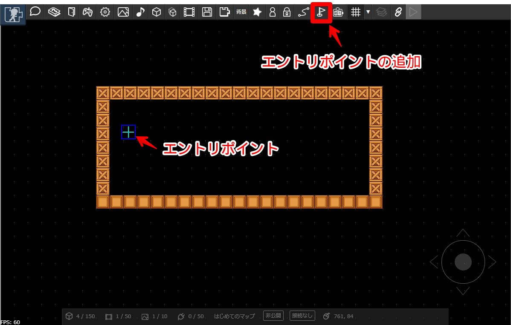
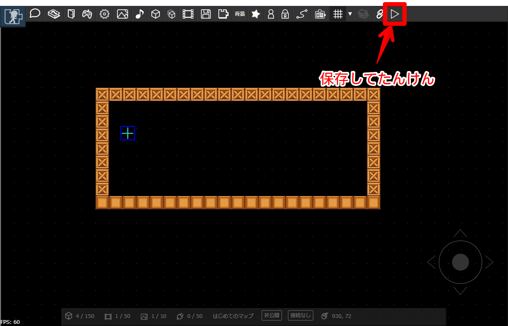
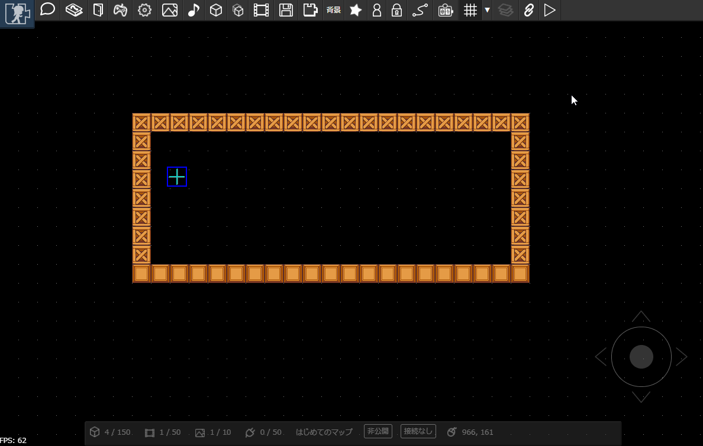

# マップをたんけんしてみる

## エントリポイントを設置

つくったマップをたんけんしてみましょう。まずはマップを保存します。PCの場合は「Ctrl+S」キーでも保存できます。

---

マップを1度でも保存したら、たんけんの開始地点である「エントリポイント」を設置できます。
（エントリポイントはマップにただ一つだけ配置できます）

## たんけんする

エントリポイントを設置すると、「保存してたんけん」ボタンを押すことできるようになります。

---

先ほど設置したエントリポイントからキャラクタが出現します。キャラクタは十字キーで動かすことができます。Zキーでジャンプもできます。

