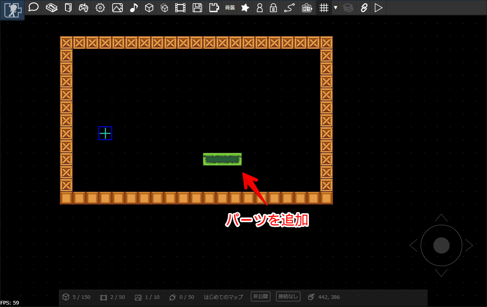
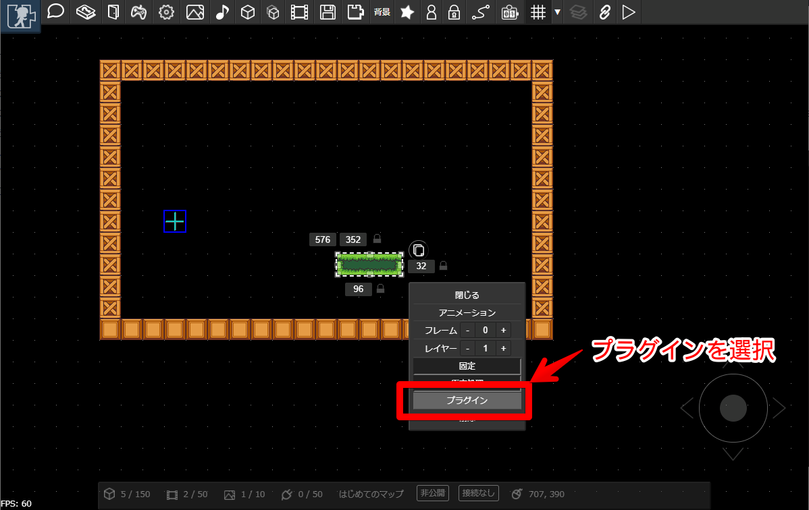
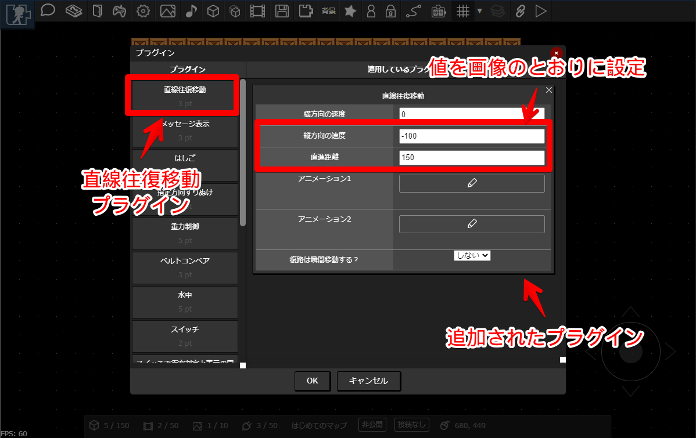
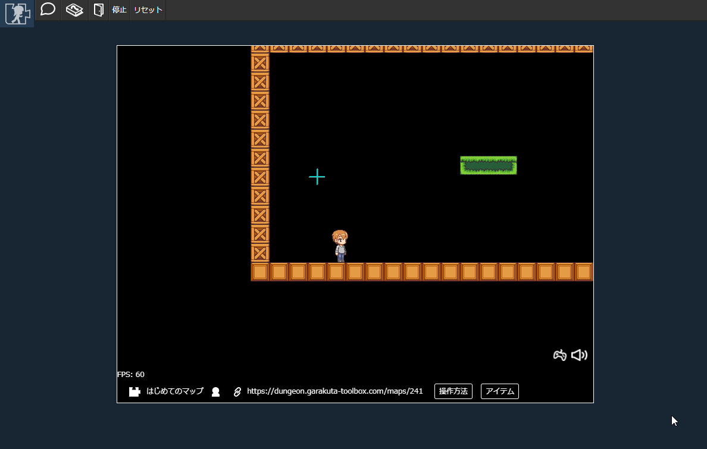

# プラグインをつかってみる

パーツに「[プラグイン](../plugin/)」を適用すると、パーツに動きをつけることができます。

## プラグインを適用するパーツの配置

マップにちょっと手を加えて、新たにパーツを配置します。これまでの手順を踏まえて、アニメーションを作ったり、パーツにアニメーションを適用したりしてみましょう。
これからプラグインを活用してパーツを上下に動かして、エレベータのような動きをつくってみます。

## プラグインの適用

パーツを選択し、「プラグイン」をクリックします。

---

プラグイン設定画面が表示されます。今回は、「直線往復移動」プラグインをつかいます。プラグインリストから「直線往復移動」を選択し、画像のように設定し、OKボタンを押します。

:::tip 設定値について
設定値の意味は以下の通りです
- 縦方向に-100の速度で動かす
- 横方向に0の速度で動かす（つまり動かさない）
- 150pxだけ移動させる

マップは左隅を原点として、右向きにX軸、下向きにY軸を取っています。なので、上向きに動かしたい場合は速度は負号をとります。
:::

## たんけんしてみる

この状態でマップを保存してたんけんしてみます。先ほどプラグインを適用したパーツが上下方向に動いています。

:::tip ワンポイント
ほかにもいろいろなプラグインがあります。[プラグイン](../plugin/) もみてみてください。たとえば以下のようなこともできます。

- メッセージの表示
- はしご
- 一方通行

プラグインを紹介するマップもあります。ぜひ見てみてください

[https://dungeon.garakuta-toolbox.com/maps/237](https://dungeon.garakuta-toolbox.com/maps/237)

:::

