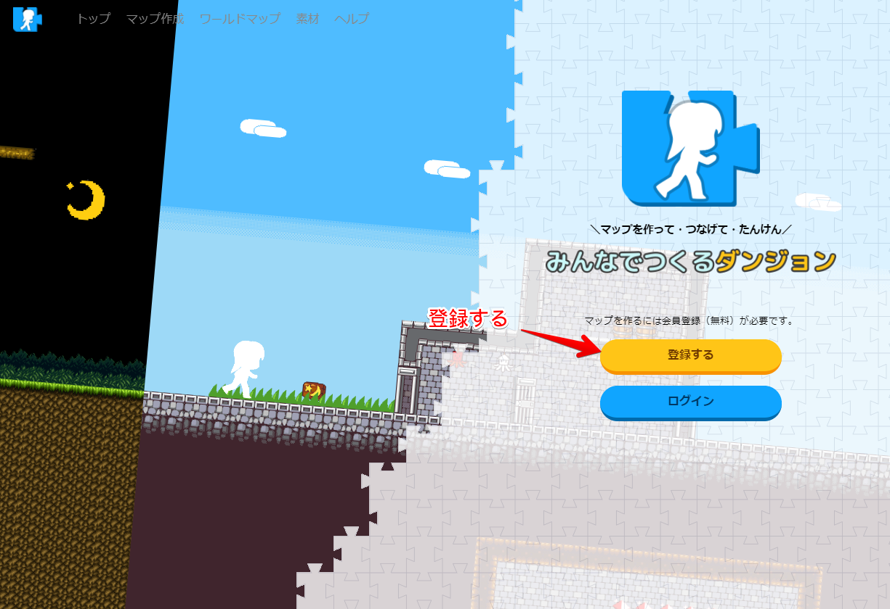
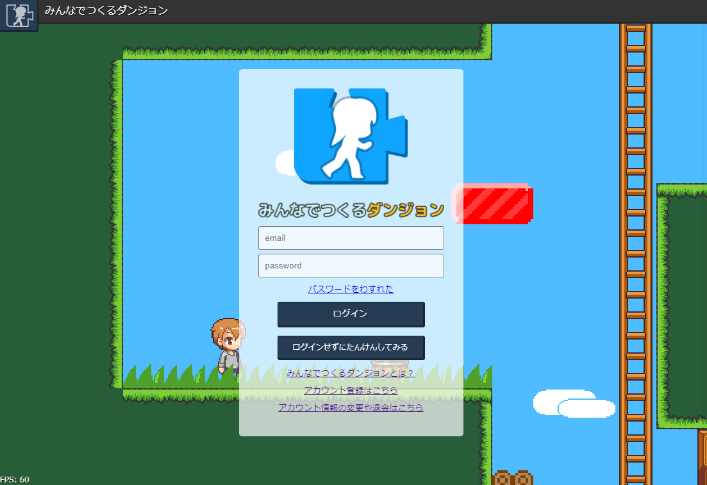
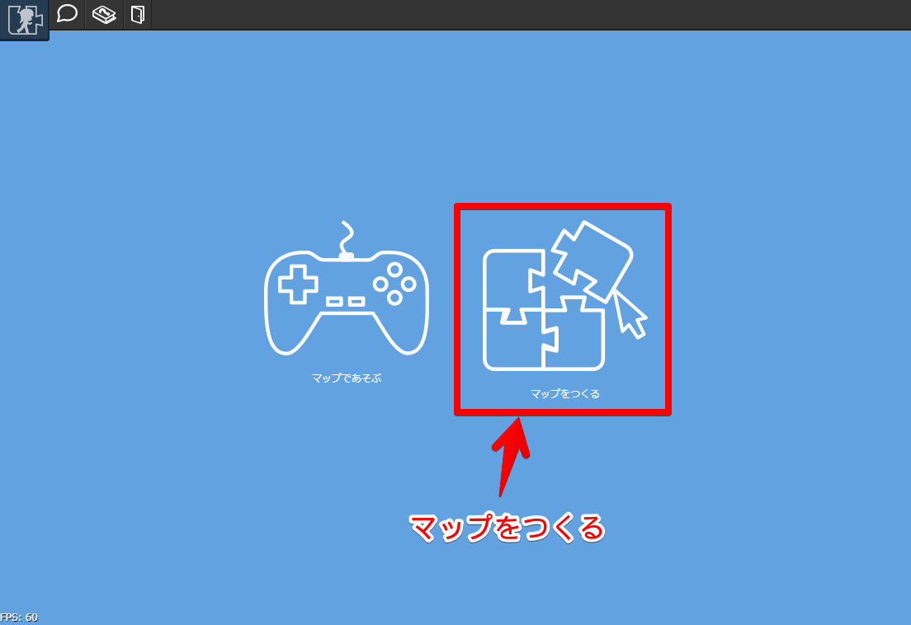
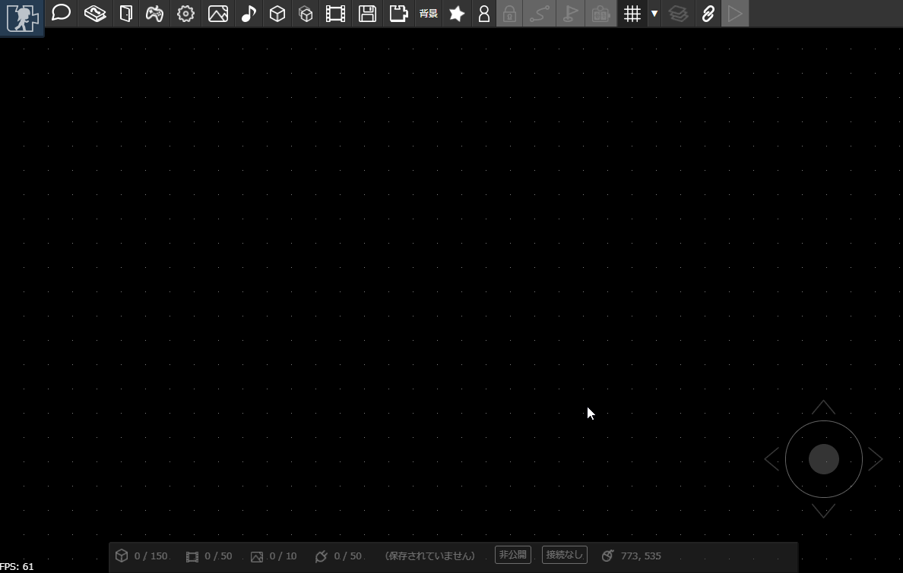
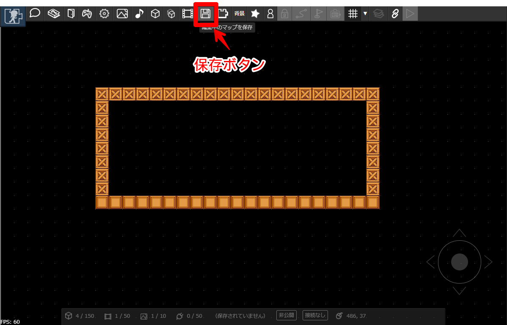
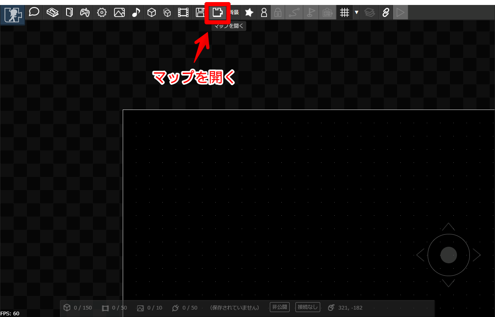
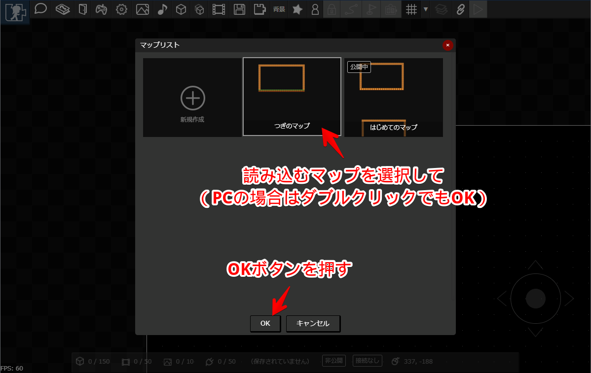

# マップを新規作成する

アカウントを作り、まっさらなマップを開いてみましょう。

## アカウントをつくる
まずはアカウントを作成します。[トップページ](https://dungeon.garakuta-toolbox.com) の以下のボタンからアカウントを作成します。

ちなみに、アカウントを作成すると、以下のことができるようになります。

- マップをつくって公開できます
- [キャラクタ](../avatar/)をカスタマイズしてマップ内をたんけんできます
- [アイテム](../item-collection)を拾ったり、[いいねカウンタ](../counter/)が設置されているマップでいいねできます
- [素材を公開](../registeration-textures/)できます

## マップの編集画面を表示する

登録が終わったら、ログインをします。[ログイン画面はこちら](https://dungeon.garakuta-toolbox.com/maps)

ログインしたら、「マップをつくる」を選びます。

マップの編集画面が表示されます。マップは左下のスティックでスクロールできます。PCの場合は、Sキーを押しながらマウスカーソルを移動させてもスクロールできます。

## マップの保存

データを失わないために、マップはこまめに保存しておきましょう。
PCの場合は「Ctrl+S」キーでも保存できます。

## 保存したマップの読み込み

マップの編集ページを開きなおしたときなど、保存したマップを再度編集する場合は、マップを開くボタンを押し、読み込みたいマップを選択してOKボタンを押します。

