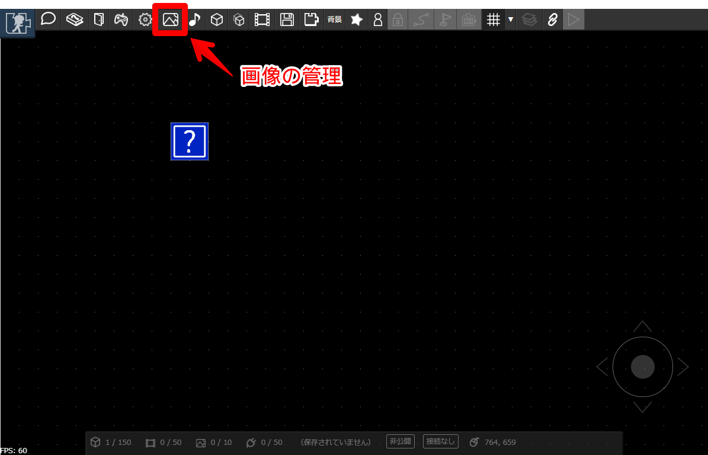
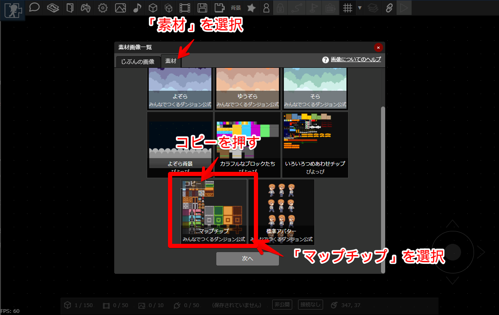
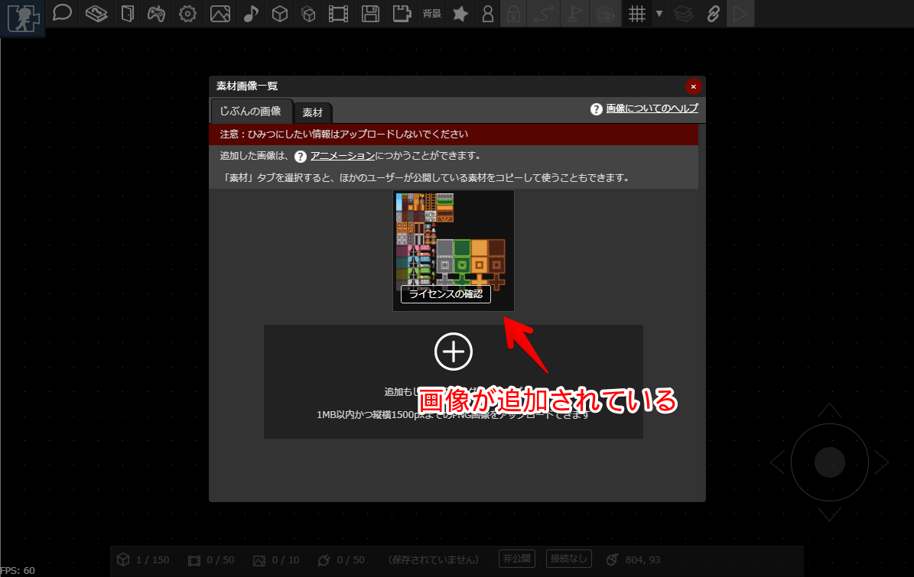
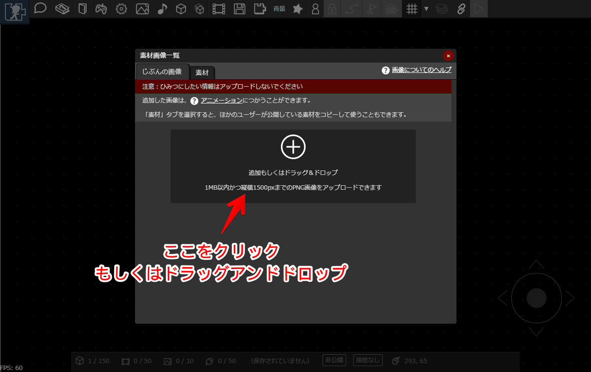

# 素材をコピー（アップロード）する

パーツに[アニメーション](../animation/)を設定することで、静止画やアニメーションを設定できます。
アニメーションを作るには画像が必要なので、まずは画像を用意します。

「画像の管理」ボタンを押します。

---

お手持ちの画像がなくても、公開されている素材をつかうことができます。
今回は、公式素材の「マップチップ」を選択してみましょう。
表示された画面の「素材」タブを選択し、「マップチップ」という素材を選択して「コピー」ボタンを押します。

コピーボタンは、PCの場合は対象の素材の上にマウスカーソルを置いたとき、スマートフォンの場合は対象の素材をタップしたときに表示されます。

:::warning 注意
コピーの際に素材の利用条件が表示されるので、確認しておきましょう。
:::

---

コピーが完了すると、「じぶんの画像」一覧にコピーした画像が表示されます。

:::tip ライセンスの確認
コピーした画像には「ライセンスの確認」ボタンが表示されます。利用条件を改めて確認したいときに押してみてください。
:::

:::tip じぶんの画像をつかうとき

表示された画面で、画像の追加ボタンを押すか、ファイルをドラッグ＆ドロップします。

素材の規格については、[画像](../texture/)を見てみてください。
:::

